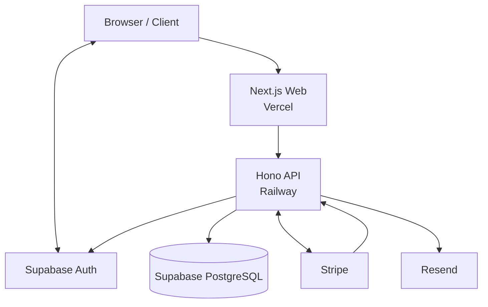

# 010 System Overview

## 1. 目的

本書は、**off r39'x in 大阪らへん2027** Webシステムの完成形における全体構造、システム境界、主要Actor、機能領域、コンポーネント責務、外部サービス境界、主要データフロー、信頼境界、およびシステム全体で守るべきInvariantを定義する。

本書は個別機能の詳細設計を定義するCanonical Ownerではない。後続仕様書が詳細化するときに解釈が分岐しないよう、以下を上流仕様として固定する。

- システムが提供する価値と対象領域
- 主要Actorとその大分類
- Web / API / Database / Auth / Payment / Emailの責務境界
- System of Recordの所在
- 外部サービスとの責任分界
- 購入、予約、チケット、受付、通知の主要処理方向
- セキュリティ上の基本的な信頼境界
- 金銭・予約・チケット処理に共通する重要Invariant
- 後続仕様書ごとのCanonical Owner境界

本書は実装フェーズを定義しない。MVP、Step1、Step2等に依存せず、長期運用される完成システムとして成立する構造を定義する。

---

## 2. 適用範囲

本書は、以下を一体のWebシステムとして扱う。

- 公開イベントサイト
- アカウント・認証
- 入場チケット販売
- 注文・決済
- 電子入場チケット
- 入場QR受付
- カラオケ予約販売
- カラオケ電子チケット
- カラオケQR受付
- グッズ販売
- グッズ在庫・会場受け渡し管理
- マイページ
- 管理画面
- スタッフ受付UI
- メール通知
- これらを支えるAPI、Database、認証、決済、通知、Hosting

本書は、会場運営そのもの、決済事業者内部のカード処理、メール事業者内部の配送処理等をシステム境界外として扱う。

---

## 3. 前提・依存仕様

本書は `SPEC-000 Specification Governance` に依存する。

仕様判断、用語、依存関係、Canonical Owner、Frontmatter、未決定事項の扱い、上流仕様変更要求は `SPEC-000` に従う。

イベント開催日時、会場、価格、販売期間、販売上限、契約条件等のうちプロジェクト所有者または外部契約によってのみ確定できる事実は、本書では固定値を捏造しない。それらは後続仕様で型・制約・管理方法を定義し、変更可能な業務データまたは設定値としてシステムへ入力できる構造とする。

---

## 4. Canonical Terms

本仕様書および後続仕様書では、少なくとも以下の名称をCanonical Termとして使用する。

| Term | 意味 |
|---|---|
| Guest | 認証されていない一般閲覧者 |
| Authenticated User | Supabase Authにより認証済みの利用者 |
| Customer | 注文、チケット、予約、グッズ購入等の顧客関係を持つAuthenticated User。権限Role名ではなく業務上のActor分類 |
| Staff | 当日受付等の運用権限を持つ認証済み運用者 |
| Administrator | 管理機能および運用設定を扱う認証済み管理者 |
| Order | 決済対象となる購入取引の内部記録 |
| Entry Ticket | イベント会場への入場権を表す電子チケット |
| Karaoke Reservation | 特定のカラオケ利用枠を確保した予約 |
| Karaoke Ticket | Karaoke Reservationの当日受付に使用する電子チケット |
| Goods Order Item | 会場受け取りを基本とするグッズ購入明細 |
| Check-in | QR等を用いて権利の有効性を確認し、利用済み状態へ移す受付処理 |
| Business Database | Supabase PostgreSQL上の業務データストア |
| Web | Vercel上で稼働するNext.jsアプリケーション |
| API | Railway上で稼働するHonoアプリケーション |

詳細な状態名、Role名、DB物理名、API名は各Canonical Owner仕様書で定義する。

---

## 5. システムの目的

本システムは、イベントの情報公開から、参加者のアカウント管理、入場権の販売、カラオケ枠の予約販売、グッズ販売、購入後の権利確認、当日受付、運用管理、通知までを、一貫したWebサービスとして提供する。

### 5.1 一般参加者への価値

GuestおよびAuthenticated Userに対して、以下を提供する。

- イベント情報をWebから確認できる
- アカウントを作成・管理できる
- 販売中の商品・チケット・予約枠を確認できる
- Stripe Checkoutを通じて安全に支払える
- 購入履歴と保有権利をマイページで確認できる
- 入場用とカラオケ用で用途の分離された電子QRを提示できる
- 必要な購入・予約・アカウント通知をメールで受け取れる

### 5.2 購入者への価値

Customerに対して、購入情報がブラウザ遷移やメール送信失敗によって失われず、決済後の権利が一貫して確認できる状態を提供する。

### 5.3 Staffへの価値

Staffに対して、当日受付に必要な権利情報をAPI経由で検証し、二重利用を防ぎながらCheck-inできるUIを提供する。

### 5.4 Administratorへの価値

Administratorに対して、注文、チケット、カラオケ枠、予約、グッズ、決済状態、受付状況等を確認・運用できる管理機能を提供する。

---

## 6. システムスコープ

### 6.1 公開イベントサイト

公開サイトは、イベント概要、開催日時、会場案内、アクセス、注意事項、FAQ、お知らせ、チケット、カラオケ、グッズ等の公開情報を提供する。

イベント開催日時、会場等の外部事実は変更可能な業務データまたは設定として扱い、コードへ不必要に固定しない。

### 6.2 アカウント

アカウント領域は、少なくとも以下を含む。

- 新規登録
- メール確認
- ログイン
- ログアウト
- パスワード再設定
- ログイン状態管理
- プロフィール管理

認証基盤はSupabase Authとする。業務Roleや購入権利のSystem of RecordをSupabase Authへ兼務させない。

### 6.3 入場チケット

入場チケット領域は、販売、注文、Stripe決済、購入確定、電子Entry Ticket発行、マイページ表示、Entry QR、当日Check-inを含む。

### 6.4 カラオケ予約

カラオケ領域は、予約可能枠の公開、空き状況表示、枠選択、一時確保、注文、Stripe決済、予約確定、Karaoke Ticket発行、Karaoke QR、当日Check-in、管理者による枠運用を含む。

カラオケの基本運用単位は「利用時間」と「整備時間」を区別できなければならない。初期参考資料で確定している標準サイクルは、利用15分 + 整備5分である。具体的な枠モデル、仮押さえ、販売制約は `SPEC-030` および `SPEC-090` がCanonical Ownerとなる。

### 6.5 グッズ販売

グッズ領域は、商品一覧、事前購入、Stripe決済、在庫管理、購入履歴、会場での受け渡し状態管理を含む。

本システムにおけるグッズ履行の基本方式は会場受け取りとする。配送物流は本システムの標準責務には含めない。将来配送を業務要件へ追加する場合は、該当Canonical Owner仕様を変更する。

### 6.6 マイページ

マイページは、Authenticated Userが自身の業務情報を確認・管理する利用者向け領域である。少なくとも以下を扱う。

- 保有Entry Ticket
- Entry QR
- Karaoke Reservation
- Karaoke Ticket / Karaoke QR
- 注文履歴・注文詳細
- Stripeが提供する領収書情報への導線
- プロフィール
- グッズ購入・受け渡し情報

### 6.7 管理画面

管理画面はAdministrator向けの運用領域であり、少なくとも以下を扱う。

- 注文管理
- 入場チケット管理
- カラオケ枠・予約管理
- 購入者確認
- Stripe関連識別情報・決済状態確認
- グッズ・在庫・受け渡し管理
- 必要な運用設定

具体的な操作権限と画面仕様は後続仕様へ委譲する。

### 6.8 スタッフ受付

Staff UIは、一般利用者画面およびAdministrator向け管理画面と権限上分離された運用領域である。

少なくとも以下を扱う。

- Entry QRの検証とCheck-in
- Karaoke QRの検証とCheck-in
- 受付対象の要約情報表示
- 無効、利用済み、取消済み等の結果表示

### 6.9 メール通知

メール領域は、アカウント確認等の認証通知、および購入・予約・運用上必要な通知を扱う。

購入や予約の確定処理とメール配送成功は分離する。メール配送失敗を理由に確定済み購入・予約・チケットを取り消してはならない。

---

## 7. Actor

### 7.1 Guest

認証前の利用者。

主な行為:

- 公開イベント情報の閲覧
- 販売情報・空き状況の閲覧
- サインアップ、ログイン、パスワード再設定の開始

Guestは、認証が必要な購入、マイページ、管理、受付操作を実行できない。

### 7.2 Authenticated User

Supabase Authにより認証済みの一般利用者。

主な行為:

- プロフィール管理
- 購入開始
- マイページ利用
- 自身に帰属する注文、チケット、予約、グッズ購入情報の参照

### 7.3 Customer

注文、チケット、予約またはグッズ購入を持つAuthenticated Userを業務上Customerと呼ぶ。

Customerは独立した権限Roleではなく、保有する業務関係から導出されるActor分類である。

### 7.4 Staff

当日受付等の限定された運用操作を実行するActor。

Staffの具体的なRole細分化、権限、時間外受付や例外操作の可否は `SPEC-060` および `SPEC-130` が定義する。

### 7.5 Administrator

販売、注文、予約、チケット、グッズ、運用設定等を管理するActor。

Administrator権限はBrowser表示だけで成立させず、APIで必ず認可する。

### 7.6 Actorの細分化

Reception Staff、Karaoke Staff等の運用Roleが必要な場合は、`SPEC-060` と `SPEC-130` で定義する。本書ではRole Permission Matrixを定義しない。

---

## 8. アーキテクチャ概要

### 8.1 採用技術スタック

本システムは以下を前提とする。

| 領域 | 技術 |
|---|---|
| Language | TypeScript |
| Monorepo | pnpm workspaces |
| Web | Next.js / React / App Router / Tailwind CSS / shadcn/ui |
| API | Hono / TypeScript / Hono RPC / Zod |
| Database | Supabase PostgreSQL |
| ORM / Driver | Drizzle ORM / node-postgres (`pg`) |
| Authentication | Supabase Auth |
| Payment | Stripe Checkout / Stripe Webhook |
| Email | Resend / React Email |
| Unit / Integration Test | Vitest |
| E2E Test | Playwright |
| Lint / Format | Biome |
| Web Hosting | Vercel |
| API Hosting | Railway |

上記技術を下流仕様が無断で置換してはならない。

### 8.2 論理構成



この図は論理責務を表す。業務操作の基本経路は以下である。

```text
Browser / Client
↓
Next.js Web
↓
Hono API
↓
Supabase PostgreSQL
```

認証のみ、Browser / WebからSupabase Authを利用してよい。認証利用を理由にBrowserまたはNext.js WebからBusiness Databaseへ直接アクセスしてはならない。

Stripe Checkoutへの遷移、StripeからBrowserへの戻り、StripeからWebhookへの通信は決済固有の例外経路であるが、業務上の決済確定処理は必ずHono APIへ集約する。

---

## 9. システムコンポーネント責務

### 9.1 Browser / Client

**主責務**

- UI表示とユーザー操作
- Next.js Webが提供する画面の実行
- Supabase Authを用いた認証操作
- 認証済みAPI呼び出しに必要なAccess Tokenの保持・送信
- 電子チケット・QRの表示
- Staff端末でのQR読み取り入力

**持ってよいロジック**

- 表示制御
- 入力補助
- UX上の事前Validation
- ローカルな画面状態

**持ってはいけないロジック**

- 購入・予約・チケットの確定判定
- 決済成功の最終判定
- 権限の最終判定
- 在庫・予約枠確保の最終判定
- QR有効性・未使用性の最終判定
- 秘密鍵、Service Role Key、Stripe Secret Key等の秘密情報

Browserから送信された値は信頼しない。

### 9.2 Next.js Web

**主責務**

- ページ・Routing
- React UI
- SSR等のWeb表示最適化
- SEO
- 認証UI
- Hono API Client
- 一般、マイページ、管理、Staff UIの表示層

**持ってよいロジック**

- 画面構成
- 表示向けデータ変換
- UX上の入力制御
- 認証セッション連携
- API呼び出しの組み立て

**持ってはいけないロジック**

- Business Databaseへの直接SQL / ORMアクセス
- Stripe決済確定を伴う業務状態遷移
- 注文、在庫、予約、Ticket、Check-inのCanonical Business Logic
- Browserだけで完結する認可判定

Next.js WebはBusiness Databaseへ直接接続してはならない。

### 9.3 Hono API

**主責務**

- 業務APIの唯一のBackend境界
- Zodによる入力Validation
- Supabase認証情報の検証
- 認可
- 注文、決済、チケット、予約、グッズ、受付等のBusiness Logic
- Drizzle / `pg`を用いたBusiness Databaseアクセス
- Transaction境界
- Stripe Checkout Session生成
- Stripe Webhook受信・署名検証・冪等処理
- 通知送信要求の生成
- 管理者・Staff操作のサーバー側検証

**持ってよいロジック**

- Route → Service → Repository相当の明確な責務分離
- 状態遷移
- 整合性制約の実行
- 外部サービスAdapter
- 冪等性処理

**持ってはいけないロジック**

- UI固有レイアウト
- Browser表示だけに必要な状態
- Stripe内部カード処理の再実装
- Supabase Authの認証基盤そのものの再実装

業務ルールの実装は原則としてAPIへ集約する。

### 9.4 Supabase Auth

**主責務**

- ユーザーIdentity
- メール・パスワード認証
- メール確認
- パスワード再設定
- Access Token等の認証Session発行

**持たせない責務**

- 注文状態
- チケット状態
- カラオケ予約状態
- グッズ在庫
- 決済確定状態
- Check-in状態
- 業務上の権利そのもの

Supabase AuthはIdentityのSystem of Recordである。業務データのSystem of Recordではない。

### 9.5 Supabase PostgreSQL

**主責務**

Business Databaseとして、以下を含む業務状態のSystem of Recordとなる。

- ユーザーに紐づく業務プロフィール
- Order / Order Item
- 販売商品・価格・販売条件に必要な内部業務データ
- Entry Ticket
- Karaoke Slot / Reservation / Karaoke Ticket
- Goods / Inventory / Handoff state
- Webhook処理記録
- 通知送信要求・送信状態に必要な業務記録
- 管理・監査に必要な永続データ

DB table、column、型、Index、Constraint、Transaction設計のCanonical Ownerは `SPEC-100` とする。

### 9.6 Stripe

**主責務**

- Stripe Checkout UI
- カード情報処理
- Payment Method処理
- 決済ネットワークとの通信
- Stripe側のPayment / Checkout状態保持
- Stripe Receiptの提供
- Webhook Event送信

本システムはカード番号等の機微なカード情報を保持しない。

Stripeは外部決済処理の権威ある情報源である。一方、本システム内のOrder、Ticket、Reservation等の業務状態はBusiness DatabaseがSystem of Recordであり、Stripeの検証済みWebhookを入力としてAPIが整合的に更新する。

### 9.7 Resend

**主責務**

- アプリケーションから依頼されたEmailの外部配送
- 配送結果情報の提供範囲内での通知

購入・予約・Ticket発行の成立条件をResend送信成功に依存させてはならない。

### 9.8 管理・Staff UI

管理UIとStaff UIは論理的に一般利用者UIから分離するが、Web実装としては同一Next.jsアプリケーション内に配置してよい。

- 表示だけで権限を成立させてはならない
- API側でActorの権限を検証する
- 一般利用者向けAPIと管理・Staff操作の責務を混同しない
- 高権限操作は後続仕様で監査対象を定義する

---

## 10. Web / API / Database責務境界

### 10.1 基本経路

業務データを読み書きする基本経路は以下とする。

```text
Browser
↓
Next.js Web
↓
Hono API
↓
Supabase PostgreSQL
```

Next.js WebからBusiness Databaseへ直接アクセスする実装は禁止する。

### 10.2 認証経路

認証は以下の経路を許可する。

```text
Browser / Next.js Web
↕
Supabase Auth

Authenticated Request
↓ Access Token
Hono API
↓ token verification / user identification
Business Logic
```

Hono APIは、認証が必要なRequestについてSupabase発行Tokenを検証し、サーバー側で利用者を特定しなければならない。

### 10.3 API型境界

WebとAPI間の型安全性にはHono RPCを使用し、入力ValidationにはZodを使用する。

ただし、Hono RPCのTypeScript型が存在することをセキュリティ境界として扱ってはならない。APIは実行時Validationと認証・認可を必ず行う。

### 10.4 Database接続主体

Business Databaseへ業務目的で接続する主体はHono APIを原則とする。

Vercel上のNext.js Web、Browser、Stripe、ResendがBusiness Databaseへ直接接続してはならない。

SupabaseがDatabase Hostingを提供することと、Supabase AuthをBrowserから利用できることは別責務として扱う。

---

## 11. System of Record

| 情報 | System of Record / Authority | 補足 |
|---|---|---|
| 認証Identity・Credential状態 | Supabase Auth | 業務プロフィール・権限とは分離する |
| Order / Ticket / Reservation / Goods / Check-in等の業務状態 | Supabase PostgreSQL | APIのみが業務ルールを通じて更新する |
| カード情報・決済ネットワーク上の処理 | Stripe | 自システムにカード情報を保持しない |
| 本システム内の支払確定状態 | Supabase PostgreSQL | Stripe検証済みWebhookを根拠としてAPIが確定する |
| Email配送の外部処理 | Resend | 業務確定状態とは分離する |
| Web Deploy Artifact / Runtime | Vercel | 業務データのSystem of Recordではない |
| API Deploy Artifact / Runtime | Railway | 業務データのSystem of Recordではない |

Business Databaseと外部サービスの情報が食い違う場合の再同期・復旧手順は `SPEC-150` がCanonical Ownerとなる。

---

## 12. 主要外部サービス境界

### 12.1 Supabase Auth境界

本システムはSupabase Authへ認証を委譲する。

本システム側は、取得したIdentityを業務Actorへ関連付け、APIで権限を評価する責務を持つ。

### 12.2 Supabase PostgreSQL境界

SupabaseはPostgreSQLのHostingを提供する。本システムはSchema、Constraint、Transaction、Query、Migration、業務整合性を管理する責務を持つ。

### 12.3 Stripe境界

StripeはPayment ProcessingとCheckoutを提供する。

本システムは以下を責任範囲とする。

- Stripe遷移前の内部Order作成
- 必要な予約・在庫確保
- Checkout Session作成要求
- Webhook署名検証
- Webhook冪等処理
- Business Databaseへの支払確定反映
- Ticket / Reservation / Goods等への業務反映
- Stripe識別子との関連付け

### 12.4 Resend境界

Resendは配送インフラを提供する。

本システムは、送信すべき通知の内容、宛先、送信要求の永続化、再試行可能性、業務処理からの分離を責任範囲とする。詳細は `SPEC-120` と `SPEC-150` へ委譲する。

### 12.5 Vercel境界

VercelはNext.js WebのHosting / Deploy Runtimeを提供する。

Webの環境変数、Build、Deploy、Domain、Runtime構成等は `SPEC-180` が定義する。

### 12.6 Railway境界

RailwayはHono APIのHosting / Deploy Runtimeを提供する。

APIの環境変数、Network、Process、Deploy、Runtime構成等は `SPEC-180` が定義する。

---

## 13. 主要データフロー

本章はSystem Overviewとしての処理方向を定義する。Endpoint名、Request Schema、DB column、Stripe Event別分岐等は後続仕様へ委譲する。

### 13.1 認証

```text
User
↓
Next.js Web / Auth UI
↓
Supabase Auth
↓
Authenticated Session / Access Token
↓
Hono API Request
↓
Token Verification
↓
Authenticated Business Operation
```

認証済み画面を表示できることと、API操作が許可されることを同一視しない。APIは各操作で認証・認可を行う。

### 13.2 入場チケット購入

```text
Customer
↓
Next.js Web
↓
Hono API
↓
Orderをpending相当の未確定状態でBusiness Databaseへ永続化
↓
Stripe Checkout Session作成
↓
Stripe Checkout
↓
Payment Processing
↓
Stripe Webhook → Hono API
↓
署名検証・冪等性確認
↓
DB Transaction
├─ Order支払確定
├─ Entry Ticket発行
└─ 関連業務状態更新
↓
Commit
↓
通知送信要求
↓
Resend
```

BrowserがCheckout Success Pageへ戻ったことのみでOrderを支払確定してはならない。

### 13.3 カラオケ予約購入

```text
Customer
↓
Next.js Web
↓
Hono API
↓
Karaoke Slotの利用可能性確認
↓
Slotを一時確保
↓
OrderをBusiness Databaseへ永続化
↓
Stripe Checkout
↓
Stripe Webhook → Hono API
↓
署名検証・冪等性確認
↓
DB Transaction
├─ Order支払確定
├─ Karaoke Reservation確定
├─ Slotを販売済みへ確定
└─ Karaoke Ticket発行
↓
Commit
↓
通知送信要求
```

一時確保の具体的期限、競合制御、Checkout期限との関係は `SPEC-090` と `SPEC-070` が定義する。

### 13.4 Stripe Webhookによる決済確定

```text
Stripe
↓ HTTPS Webhook
Hono API Webhook Endpoint
↓
Stripe署名検証
↓
Event重複判定
↓
対象Order照合
↓
必要なBusiness Rule検証
↓
DB Transactionによる一度だけの状態反映
↓
Webhook処理済み記録
```

Webhook Endpointは一般利用者用のSupabase Auth Sessionを認証根拠としない。Stripe署名を外部送信元検証の根拠とする。

### 13.5 電子チケット表示

```text
Authenticated User
↓
Next.js Mypage
↓
Hono API
↓
認証・所有権確認
↓
Business Database
↓
Ticket / Reservation Summary
↓
Next.js Web
↓
電子Ticket / QR表示
```

Browserは任意のTicket IDを指定しただけで他者のTicketを取得できてはならない。

### 13.6 Entry QR受付

```text
Entry Ticket Holder
↓ QR提示
Staff Browser
↓
Staff UI
↓
Hono API
↓
Staff認証・認可
↓
QR Token検証
↓
Entry Ticket状態確認
↓
原子的なCheck-in
↓
Business Database
↓
受付結果表示
```

有効性確認と利用済み化の間に競合窓を作らず、二重利用を防止しなければならない。

### 13.7 Karaoke QR受付

```text
Karaoke Ticket Holder
↓ QR提示
Staff Browser
↓
Staff UI
↓
Hono API
↓
Staff認証・認可
↓
Karaoke QR検証
↓
Reservation / Ticket状態・予約時刻確認
↓
原子的なCheck-in
↓
Business Database
↓
受付結果・必要な警告表示
```

Entry QRとKaraoke QRは別用途・別権利として扱い、相互代用しない。

### 13.8 管理操作

```text
Administrator
↓
Admin UI
↓
Hono API
↓
Authentication
↓
Authorization
↓
Business Rule Validation
↓
Business Database / 必要な外部Service
↓
Result
```

画面を非表示にするだけで管理操作を保護してはならない。

### 13.9 メール通知

```text
Business Transaction Commit
↓
永続化された通知送信要求
↓
Email Processing
↓
Resend
↓
Recipient
```

Email送信失敗は再送可能な通知失敗として扱い、成功済みBusiness TransactionをRollbackしない。

---

## 14. セキュリティ・信頼境界の概要

詳細は `SPEC-140` がCanonical Ownerとなる。本システム全体では以下を必須原則とする。

### 14.1 Browserは信頼しない

Browserから送信される以下を含むすべての業務入力は改ざん可能として扱う。

- user ID
- order ID
- ticket ID
- price
- product type
- role
- payment result
- slot availability
- QR value

APIは信頼できるServer-side dataと認証Identityを用いて再検証する。

### 14.2 決済成功をBrowser redirectで確定しない

Stripe CheckoutのSuccess URLへ到達した事実はUI上の案内に利用してよいが、Orderの支払確定根拠としては使用しない。

### 14.3 Stripe Webhook署名を検証する

決済関連Webhookは署名検証に成功したEventだけを処理対象とする。

### 14.4 APIで認証・認可する

認証が必要な一般操作、Administrator操作、Staff操作はAPI側でActorを特定し、操作対象との関係および権限を検証する。

### 14.5 QR値を推測困難にする

Entry QRとKaraoke QRには、単純なDB連番等の推測可能な値をセキュリティ境界として使用しない。

QR Tokenの形式、保存方式、ローテーション等は `SPEC-080` が定義する。

### 14.6 管理・Staff操作を一般利用者から分離する

URLやUIの分離に加え、API認可によって権限境界を強制する。

### 14.7 SecretをClientへ露出しない

以下を含むServer SecretをBrowserへ配布してはならない。

- Stripe Secret Key
- Stripe Webhook Secret
- Supabase Service Role Key
- Database Credential
- Resend API Key
- その他Server-only Credential

公開可能なClient設定値と秘密情報の分類は `SPEC-140` および `SPEC-180` が定義する。

---

## 15. データ整合性上のSystem Invariants

以下はシステム全体の重要Invariantであり、後続仕様はこれらを弱めてはならない。

### INV-010-01 購入情報を失わない

Stripeへ遷移する前に、本システム側で購入試行を追跡できるOrderをBusiness Databaseへ永続化しなければならない。

Browser離脱、redirect失敗、Email失敗が発生しても、支払照合に必要な内部記録を失ってはならない。

### INV-010-02 Orderを二重確定しない

同一の支払についてWebhook再送、Network retry、Client retry等が発生しても、Orderの支払確定を論理的に一度だけ成立させなければならない。

### INV-010-03 Ticketを二重発行しない

同一の購入権利について、同一原因から重複するEntry TicketまたはKaraoke Ticketを発行してはならない。

複数枚購入が許可される場合は、購入された数量に対応する正規の複数Ticketと、同一Ticketの重複発行を区別する。

### INV-010-04 カラオケ枠を二重販売しない

排他的である同一Karaoke Slotを、同時購入やretryによって複数Customerへ販売済みとして確定してはならない。

### INV-010-05 QR Ticketを二重利用させない

一度だけ利用可能なEntry TicketおよびKaraoke Ticketについて、並行ScanやretryがあってもCheck-inを一度だけ成立させなければならない。

### INV-010-06 Email失敗で購入確定をRollbackしない

Order、Ticket、Reservation等のBusiness Transactionが正常Commitした後のEmail配送失敗を理由として、そのBusiness TransactionをRollbackしてはならない。

### INV-010-07 決済確定と権利発行を中途半端に残さない

Orderの支払確定と、それにより必須となるTicket / Reservation等の業務状態更新は、可能な範囲で同一のDatabase Transactionに含める。

外部サービス呼び出しのため単一Transactionへ含められない処理は、再試行・再同期可能な状態を永続化し、不可視の中間状態へ放置してはならない。

### INV-010-08 所有権と権限をServer-sideで検証する

利用者が任意の識別子を知っていることだけを根拠に、他者のOrder、Ticket、Reservation、Profile等へアクセスさせてはならない。

### INV-010-09 金額をClient入力だけで確定しない

支払金額、商品種別、販売条件等の決済上重要な値は、APIがBusiness Database上の信頼できる販売情報から決定する。

### INV-010-10 外部処理の再送に耐える

Stripe Webhook、Email送信、Client retry等、重複発生が通常想定される処理は、後続仕様で冪等または安全に再実行可能な設計としなければならない。

---

## 16. エラー・障害に対する全体原則

詳細は `SPEC-150` がCanonical Ownerとなる。

System Overviewとして以下を定義する。

- 外部サービス障害を業務データ消失へ連鎖させない
- Stripe Webhook再送を正常系として扱えるようにする
- Email失敗は購入確定失敗と分離する
- Client retryで二重購入・二重受付を起こさない
- 重要な状態遷移は再照合可能な外部識別子と内部記録を持つ
- 障害復旧時にBusiness Databaseを中心に現在状態を確認できるようにする
- 不可逆な高権限操作は監査可能にする

具体的な再試行回数、Backoff、Dead Letter相当の処理、手動復旧Runbook等は本書では定義しない。

---

## 17. システム境界外

以下は本Webシステムが直接のSystem of Recordまたは実行主体として責任を持たない。

### 17.1 Stripe内部の決済処理

- カード番号保管
- カードネットワーク処理
- Issuerとの認証・承認
- Stripe内部Fraud判定
- Stripe内部Receipt生成処理

本システムはStripeから提供される結果を検証し、内部業務状態へ反映する。

### 17.2 Resendおよび下流メール網の内部配送処理

本システムは送信要求と業務上必要な送信状態を管理するが、受信者Mail Serverまでの内部配送実装を担わない。

### 17.3 Supabase Auth内部のCredential処理

Password hash等の認証基盤内部実装はSupabase Authの責務である。

### 17.4 会場の物理運営

以下はシステムそのものの責務外である。

- 会場契約
- 物理的な入退場誘導
- 警備
- カラオケ機材運用
- 現物グッズ保管・搬送そのもの
- 現金等、本システム外で実施する運用

ただし、それら運用を支援する情報管理や受付記録はシステムスコープに含み得る。

### 17.5 外部イベント運営上の事実

開催日、会場、価格、販売上限、注意事項、契約条件等の事実そのものを本システムが決定するわけではない。

本システムは、確定した外部事実を業務データまたは設定として保持・表示・適用できる構造を提供する。

---

## 18. デプロイ境界の概要

完成システムのHosting境界は以下とする。

```text
Internet User / Staff / Administrator
        |
        v
Vercel: Next.js Web
        |
        | HTTPS
        v
Railway: Hono API
   |        |        |
   v        v        v
Supabase   Stripe   Resend
PostgreSQL/Auth
```

Supabase AuthはBrowser / Webから認証用途で利用できる。

本書はSecret名、Environment名、Deploy手順、Network Policy、Domain、CI/CD等の詳細を定義しない。これらは `SPEC-180` がCanonical Ownerとなる。

---

## 19. Monorepo上の論理責務

物理ディレクトリの最終詳細は `SPEC-190` 等で定義するが、少なくとも以下の論理分離を維持する。

```text
apps/
├─ web/       # Next.js Web
└─ api/       # Hono API

packages/
└─ shared/    # Hono RPC型、Zod Schema、共有型・定数等
```

`packages/shared` は共有可能な契約や純粋な型・Validationを置くために使用してよいが、Database接続SecretやAPI専用Business LogicをWebへ漏出させる共通箱として使用してはならない。

---

## 20. 後続仕様書との責務分担

本章は、各詳細のCanonical Ownerを定める。下流仕様書は本書のSystem BoundaryとInvariantを維持しながら具体化する。

| SPEC | Canonical Ownerとなる主な詳細 | SPEC-010が定義する範囲 |
|---|---|---|
| SPEC-020 Functional Requirements | 完成システムの機能要件、Actor別Capabilities、機能ごとの成立条件 | 機能領域と全体目的のみ |
| SPEC-030 Domain Model & Business Rules | Domain Entity、状態、状態遷移、販売・所有・予約等の業務ルール | 主要Domainの存在とSystem Invariantのみ |
| SPEC-040 User Flows | 一般ユーザーの詳細フロー、分岐、失敗時UX | 主要データフローの方向のみ |
| SPEC-050 Page / Screen Specification | URL、画面、Field、表示、操作、Navigation | UI領域の存在と責務のみ |
| SPEC-060 Authentication / Authorization | 認証方式詳細、Role、Permission Matrix、Session、認可規則 | Supabase Auth採用、API認可原則、Actor大分類 |
| SPEC-070 Order / Payment | Order lifecycle、Stripe Checkout、Webhook Event処理、返金、冪等性、決済復旧 | Stripe前Order永続化、Webhook確定原則、二重確定禁止 |
| SPEC-080 Ticket / QR / Check-in | Ticket lifecycle、QR Token形式、検証、Check-in競合制御 | Entry/Karaoke QR分離、推測困難性、二重利用禁止 |
| SPEC-090 Karaoke Reservation | Slot model、hold、競合制御、販売制約、当日受付規則 | Karaoke領域、利用/整備時間区別、二重販売禁止 |
| SPEC-100 Database Design | Table、Column、Type、Constraint、Index、Transaction、Migration | PostgreSQLをBusiness SoRとすること |
| SPEC-110 API Specification | Endpoint / Hono RPC contract、Zod Schema、Error response、HTTP details | Hono APIを業務Backend境界とすること |
| SPEC-120 Email Notification | 通知種別、Template、送信条件、再送、配信状態 | Resend / React Email採用、業務確定と送信成否の分離 |
| SPEC-130 Admin / Staff | 管理・Staff画面の機能、例外操作、運用権限 | Admin/Staff領域の存在、API認可必須 |
| SPEC-140 Security | Threat、Secret、Token、CSRF/CORS等を含む詳細Security requirement | Trust Boundaryと主要Security Principle |
| SPEC-150 Reliability / Error Recovery | Retry、再同期、復旧手順、不整合修復、外部障害対応 | データ消失防止・再実行安全性の全体原則 |
| SPEC-160 Observability / Audit Log | Log、Metric、Trace、Audit event、Retention | 高権限・重要処理を観測可能にする原則 |
| SPEC-170 Test Specification | Unit / Integration / E2E / Acceptance前検証の詳細 | Vitest / Playwright採用、Invariantを検証対象とすること |
| SPEC-180 Infrastructure / Deployment | Vercel、Railway、Supabase、環境、Secret、Deploy、Network | Hostingサービスと配置境界 |
| SPEC-190 AI Development Guidelines | Repository規約、実装手順、AI向け作業ルール、品質Gate | AI実装容易性と明確な責務分離の原則 |
| SPEC-200 System Acceptance Criteria | 完成システム全体の受入条件 | System Overviewの成立条件とInvariantを上位基準として提供 |

グッズ販売について独立仕様が必要になる場合でも、まず `SPEC-020` / `SPEC-030` / `SPEC-050` / `SPEC-070` / `SPEC-100` / `SPEC-110` / `SPEC-130` に吸収可能かを確認し、不要な仕様分割を避ける。

---

## 21. 実装上の禁止事項

本書から直接導出される禁止事項を以下に列挙する。

- Next.js WebからBusiness Databaseへ直接アクセスする
- BrowserからBusiness Databaseへ直接アクセスする
- Stripe Success redirectだけでOrderをpaid相当へ確定する
- 未検証のStripe Webhookを処理する
- Clientから受け取ったpriceをそのまま決済金額として信頼する
- Supabase Authの認証済みであることだけをAdministrator / Staff権限の根拠にする
- 単純なDB連番をそのままQRの秘密値として使用する
- Entry QRとKaraoke QRを同じ権利として兼用する
- メール送信をOrder / Ticket / Reservation確定Transactionの成功条件にする
- カラオケSlotの競合をBrowser側表示だけで防止する
- QR Check-inの二重利用防止をClient側状態だけで行う
- Secret KeyをClient bundleへ含める
- 下流仕様が採用済み技術スタックを無断で置換する

---

## 22. 受入条件

本System Overviewは、以下をすべて満たす場合に成立する。

1. 完成システムの主要機能領域が、公開サイト、アカウント、入場チケット、カラオケ、グッズ、マイページ、管理、Staff受付、通知まで一貫して定義されている
2. Guest、Authenticated User、Customer、Staff、AdministratorのActor大分類が定義されている
3. Next.js Web、Hono API、Supabase Auth、Supabase PostgreSQL、Stripe、Resend、Vercel、Railwayの責務境界が明確である
4. Business Databaseアクセスの基本経路が `Browser → Next.js Web → Hono API → PostgreSQL` として定義されている
5. Next.js WebからBusiness Databaseへの直接アクセスが禁止されている
6. Supabase Authの認証責務とBusiness Databaseの業務データ責務が分離されている
7. Stripe Webhookを決済確定の根拠とし、Browser redirectを確定根拠としない
8. Order、Ticket、Karaoke Slot、QR Check-in、Emailに関する主要Invariantが明文化されている
9. Entry QRとKaraoke QRの用途が分離されている
10. Browser、管理UI、Staff UI、Webhook、外部Service間の信頼境界が明確である
11. System of Recordの所在が明確である
12. SPEC-020〜SPEC-200のCanonical Owner境界が定義され、SPEC-010が詳細仕様を過剰に所有していない
13. 外部事実を捏造せず、変更可能な業務入力として扱う原則が定義されている
14. MVP / Step等の実装フェーズによって正式仕様が分断されていない
15. 本書の内容が `SPEC-000` のガバナンス規則に従っている

---

## 23. 上流仕様変更要求

なし。
