# 030 Domain Model & Business Rules

## 1. 目的

本書は、**off r39'x in 大阪らへん2027** Webシステムの完成形におけるDomain Model、Aggregate境界、Entity間関係、業務状態、状態遷移、Business Rule、Domain Invariantを定義する。

本書は `SPEC-010 System Overview` のSystem Boundary・System of Record・System Invariantと、`SPEC-020 Functional Requirements` の `FR-*` を変更または弱化せず、Order、Ticket、Karaoke、Goods、Check-in、Notification等の後続仕様が共通して参照するCanonicalなDomain Ruleへ変換する。

本書がCanonical Ownerとなるのは、少なくとも以下である。

- Domain Entity / Aggregate / Value Object / Configurationの論理的な存在と意味
- Entity間のCardinality、所有関係、参照関係
- 業務状態の名称と意味
- Domain-levelの許可状態遷移・禁止遷移
- 販売数量、購入制限、在庫、Karaoke Slot排他、所有権、受け渡し、Check-in等のBusiness Rule
- 同一支払、同一権利、同一在庫、同一Slot、同一Check-inを重複確定させないDomain Invariant
- `FR-*` および `INV-010-*` とのTraceability

本書はDatabase Table / Column / Index / SQL、API Endpoint / HTTP Status、Stripe Event名・Checkout Session field、QR Token形式、Karaoke holdの具体秒数、画面Layout等を定義しない。これらは各下流Canonical Ownerへ委譲する。

## 2. 適用範囲

本書は以下のDomainへ適用する。

- Event / Public Information
- User / Business Profile / Ownership
- Sales Configuration
- Order / Order Item
- Entry Ticket販売・発行・利用権
- Karaoke Slot / Hold / Reservation / Karaoke Ticket
- Goods / Inventory / Goods Handoff
- Entry Check-in / Karaoke Check-in
- Notification Request
- 上記に共通する時刻、金額、数量、所有権、状態遷移、冪等性、回復可能性

本書は、イベント開催日時、会場、実価格、実販売数量、実在庫数等の外部事実を固定しない。これらは本書で定義するConfigurationまたはEntityが保持する値として扱う。

## 3. 前提・依存仕様

本書は以下へ依存する。

- `SPEC-000 Specification Governance`: Canonical Owner、依存関係、時刻・金額・識別子、Upstream Change Request等のガバナンス
- `SPEC-010 System Overview`: Actor、System Boundary、System of Record、主要Data Flow、Security Principle、`INV-010-*`
- `SPEC-020 Functional Requirements`: 完成システムの `FR-*`

本書のDomain Entityは、Supabase PostgreSQLがBusiness Databaseであること、および業務状態のSystem of Recordであることを前提とする。一方、Supabase Auth IdentityのCredential状態はSupabase Auth、外部決済処理の権威ある結果はStripeが保持するという上流の責務分離を維持する。

## 4. Canonical Domain Terms

本書は上流仕様のCanonical Termsを継承し、以下を追加する。

| Term | Canonicalな意味 |
|---|---|
| Business Profile | Supabase Auth Identityと1対1で対応し、業務データ上の本人・所有者を表すEntity |
| Event | 本Webシステムが扱う対象イベントの業務上のルート情報 |
| Entry Ticket Offering | Entry Ticketとして販売する種別と販売条件を表すConfiguration Entity |
| Sales Period | 新規購入を許可する日時範囲。開始を含み終了を含まない半開区間 |
| Purchase Limit | 同一Business Profileに許可する購入数量上限のRule |
| Order | 一回の決済対象となる購入取引の内部記録。外部決済へ遷移する前に必ず存在する |
| Order Item | Order内の購入対象明細。Entry Ticket、Karaoke、Goodsのいずれか1種類の購入対象へ結び付く |
| Sales Allocation | 支払確定前に有限数量を排他的に確保する論理的な割当。Entry TicketとGoodsで使用する |
| Entry Ticket | 1名分のイベント入場権を表す独立した権利Entity |
| Karaoke Slot | Karaokeの排他的販売・利用単位。利用時間と整備時間を含む占有区間を持つ |
| Karaoke Hold | 支払確定前に1つのKaraoke Slotを1 Customerの購入試行へ排他的に一時確保した状態を表すEntity |
| Karaoke Reservation | 支払確定によって成立した、特定Karaoke Slotを利用するCustomerの予約権 |
| Karaoke Ticket | Karaoke Reservationの当日受付に用いる、Reservationごとの一回利用権 |
| Goods | 販売対象の商品定義 |
| Goods Inventory | Goodsの販売可能数量と確保・確定販売の整合性を支えるDomain概念 |
| Goods Order Item | Goodsを購入するOrder ItemのDomain subtype |
| Goods Handoff | 確定済みGoods Order Itemの会場受け渡し状態を表すEntity |
| Entry Check-in | Entry Ticketの一回利用が成立したBusiness Event |
| Karaoke Check-in | Karaoke Ticketの一回利用が成立したBusiness Event |
| Notification Request | 確定済みBusiness Transactionから分離して作成される、再試行可能な通知送信要求 |
| Domain Trigger | 外部サービスやAPI実装に依存しない、業務上の状態遷移原因 |

同一概念について、本書では上記名称を使用する。`booking`、`reservation purchase` 等の別名を新たなDomain名として導入しない。

## 5. Domain設計原則

### 5.1 System of Record

`Order`、`Order Item`、`Entry Ticket`、`Karaoke Slot`、`Karaoke Hold`、`Karaoke Reservation`、`Karaoke Ticket`、`Goods Inventory`、`Goods Handoff`、`Check-in`、`Notification Request`等の現在の業務状態はBusiness DatabaseをSystem of Recordとする。

外部決済結果を業務状態へ反映する場合も、外部側の状態だけを直接利用者権利として扱わず、本書の状態遷移がBusiness Databaseへ成立した後の状態をCanonicalな業務状態とする。

### 5.2 Aggregateを越える不変条件

本書の重要な購入確定操作は複数Aggregateへまたがる場合がある。後続仕様は、次のいずれかを満たさなければならない。

1. 1つのDatabase Transactionで同時に成立させる。
2. 外部Service等の理由で単一Transactionに含められない場合、再試行・再同期可能な追跡状態を残し、利用者へ中途半端な確定権利を提示しない。

### 5.3 Client値はDomain Authorityではない

price、purchase quantity、role、payment result、inventory、slot availability、owner identifier等、Clientから送信可能な値はDomain Authorityではない。Domain Ruleの判定は、認証済みIdentityとBusiness Database上の現在状態、および検証済みの外部権威情報を用いる。

### 5.4 正規の複数権利と重複生成を区別する

数量2のEntry Ticket購入から2枚のEntry Ticketが生成されることは正規である。同じ数量単位から同一権利を2回生成することが重複発行であり禁止される。

この区別を成立させるため、数量購入はDomain上で購入数量単位を一意に識別可能でなければならない。DB上の具体的なキー表現は `SPEC-100` が定義する。

### 5.5 所有権は権利状態と分離する

Owner / Customerの帰属と、権利が `VALID`、`USED`、`CANCELED` 等のどの状態にあるかは別概念である。権利が取消済みになっても、その履歴上の所有者を別人へ付け替えない。

### 5.6 Ticket譲渡は存在しない

上流仕様にTicket譲渡Capabilityは存在しないため、本書はEntry Ticket、Karaoke Reservation、Karaoke Ticket、Goods購入の通常の所有権移転を定義しない。所有権変更は通常操作として禁止する。将来譲渡を追加する場合は上流Requirement変更が必要である。

## 6. Domain Model概要

### 6.1 Aggregate一覧

| Aggregate / Entity | 種別 | 主責務 |
|---|---|---|
| Event | Aggregate Root | イベント基本情報と公開情報の所属先 |
| FAQ Item | Entity | 公開FAQの質問・回答・公開状態 |
| Announcement | Entity | お知らせ本文と公開状態 |
| Business Profile | Aggregate Root | 認証Identityと業務上の本人・所有者の対応 |
| Entry Ticket Offering | Aggregate Root | Entry Ticket種別、価格、販売期間、販売数量、購入制限、販売停止 |
| Order | Aggregate Root | 外部決済前から追跡する購入取引とOrder Itemの整合性 |
| Order Item | Entity | Order内の購入対象と購入時条件の論理Snapshot |
| Entry Sales Allocation | Entity / Allocation | Entry Ticket販売数量の支払前確保 |
| Entry Ticket | Aggregate Root | 1枚ごとの入場権、状態、Owner |
| Karaoke Slot | Aggregate Root | 排他的Slotの販売可否、時間、Hold / Sold整合性 |
| Karaoke Hold | Entity | Slotの一時確保とその購入試行への帰属 |
| Karaoke Reservation | Aggregate Root | 支払確定済みSlot利用権 |
| Karaoke Ticket | Aggregate Root | Reservationの当日受付用一回権利 |
| Goods | Aggregate Root | 商品定義と販売条件 |
| Goods Inventory | Aggregate / logical boundary | 商品ごとの販売可能数量と割当整合性 |
| Goods Sales Allocation | Entity / Allocation | 支払前のGoods在庫確保 |
| Goods Order Item | Order Item subtype | 購入したGoods、数量、購入時条件 |
| Goods Handoff | Entity | 会場受け渡しの一回完了状態 |
| Entry Check-in | Immutable Event Entity | Entry Ticketの利用成立記録 |
| Karaoke Check-in | Immutable Event Entity | Karaoke Ticketの利用成立記録 |
| Notification Request | Aggregate Root | Business Transactionと分離した通知要求・送信状態 |
| Consistency Review Case | Domain support entity | 自動継続が安全でない外部/内部不整合を人手確認対象として追跡 |

`Consistency Review Case` は通常業務の成功状態ではない。外部決済の権威ある結果とBusiness Databaseの反映状態等に安全に自動解決できない不整合が生じた場合だけ作成する。Retry回数、Runbook、監視方法は `SPEC-150` / `SPEC-160` が定義する。

### 6.2 論理関係図

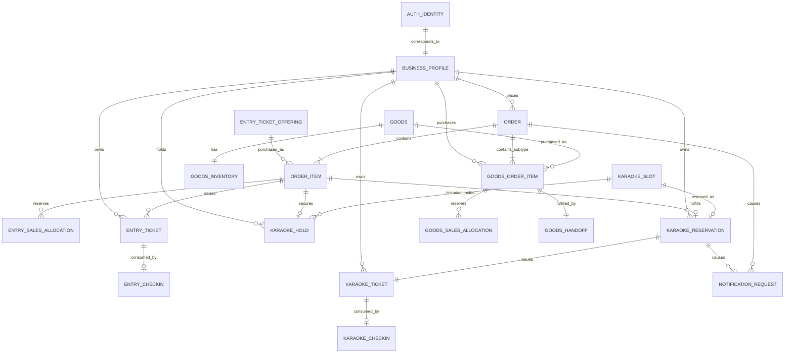

上図は論理Cardinalityを示し、DB tableやForeign Keyの物理設計を固定しない。

## 7. 共通Value Object / Configuration

### 7.1 Money

`Money` は以下のDomain意味を持つ。

- `amount`: 通貨の最小単位による0以上の整数
- `currency`: 当該金額の通貨を識別する値

浮動小数点を金額のCanonical表現として使用してはならない。

購入開始後のOrder / Order Itemは、購入開始時点でServer-sideから決定した価格と通貨のSnapshotを保持し、後から販売設定が変更されても既存Orderの金額を暗黙に書き換えない。

### 7.2 Quantity

購入数量・販売数量・在庫数量は0以上の整数で表す。購入要求数量は対象商品に対して1以上でなければならない。上限値は対象Domainの販売設定に従う。

### 7.3 Business Timezone

本システムの業務上の基準Timezoneは **`Asia/Tokyo`** とする。

- イベント開催日時、販売期間、Karaoke Slot、受付判断等の業務上の「何日」「何時」は `Asia/Tokyo` を基準に解釈する。
- 絶対時刻と日付だけの情報を混同しない。
- 保存形式やAPI wire formatは `SPEC-100` / `SPEC-110` が定義する。

### 7.4 Sales Period

`Sales Period` は `[starts_at, ends_at)` の半開区間とする。

- `starts_at` と同時刻から新規購入を許可できる。
- `ends_at` と同時刻以降は新規購入を許可しない。
- `ends_at` は `starts_at` より後でなければならない。
- 販売停止はSales Periodとは独立したControlであり、期間内でも新規購入を禁止できる。

### 7.5 Purchase Limit

`Purchase Limit` は対象販売単位ごとに、1 Business Profileが確定できる最大数量を定義する。

購入可否判定では、少なくとも次を合算対象とする。

- 当該Business Profileの確定済み購入数量。権利が後から取消済みになっても、Purchase Limit消費を明示的に回復させる正規のDomain operationが成立しない限り計数対象に残す
- 当該Business Profileが現在有効なSales AllocationまたはKaraoke Holdとして確保中の数量
- 同一Orderのretryによる重複要求は新しい権利として重複計数しない

取消・解放済みの一時確保は購入制限の消費量から除外する。Refundの存在だけで確定済み購入のPurchase Limit消費を自動回復させてはならない。回復させる場合は対象Domainの正規取消Ruleとして明示的に成立させる。

### 7.6 Sale Control State

販売対象の運用上の制御状態は次の2状態とする。

- `ENABLED`: Sales Period、数量、購入制限等の他条件を満たす場合に新規購入可能
- `SUSPENDED`: 新規購入を禁止する。既存Order・確定済み権利を暗黙に取消さない

公開表示用の「販売開始前」「販売中」「販売終了」「売り切れ」「購入制限到達」等は、Control State、Sales Period、在庫・容量、Actorごとの購入制限から導出する。画面上の文言は `SPEC-050` が定義する。

## 8. Event / Public Information Domain

### 8.1 Event

`Event` は本システムが扱うイベントの業務上のルート情報であり、少なくとも以下の論理情報を所有する。

- イベント名称
- 概要
- 開催日時または開催期間
- 会場名称
- 会場案内・アクセス情報
- 注意事項
- FAQ Item群
- Announcement群

開催日時・会場等が未確定の場合、未確定値を推測して公開してはならない。公開可能な情報だけを公開状態へ遷移させる。

### 8.2 Publication State

FAQ Item、Announcementその他公開/非公開を切り替える独立コンテンツは以下の状態を持つ。

- `DRAFT`: 運営編集対象だが一般公開しない
- `PUBLISHED`: Guestを含む利用者へ公開する
- `ARCHIVED`: 過去情報として通常公開対象から外す。履歴として保持してよい

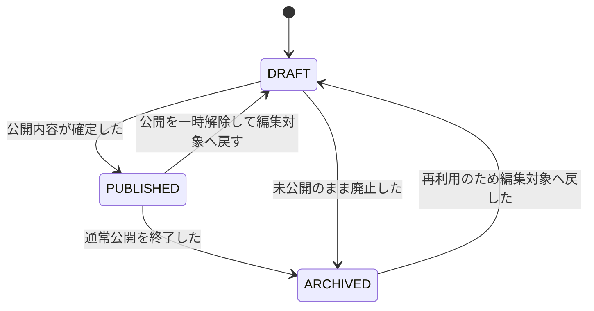

`ARCHIVED` から直接 `PUBLISHED` へ遷移させず、一度 `DRAFT` に戻して公開対象内容を確認する。

### 8.3 Event Business Rules

| Rule ID | Rule | 関連FR | 関連Invariant |
|---|---|---|---|
| BR-EVT-001 | Eventの開催日時、会場、注意事項等は変更可能なDomain情報として保持し、外部事実が未設定の場合に推測値を生成してはならない。 | FR-PUB-001〜004, FR-PUB-011, FR-ADM-018, FR-XFN-022〜023 | - |
| BR-EVT-002 | Guestへ返すFAQ / Announcementは `PUBLISHED` のものだけとし、`DRAFT` / `ARCHIVED` を公開データとして扱ってはならない。 | FR-PUB-005〜006 | INV-010-08 |
| BR-EVT-003 | 公開情報の変更は既に成立したOrder、Ticket、Reservation、Goods購入の権利内容を暗黙に変更または取消してはならない。 | FR-XFN-023 | INV-010-01, INV-010-07 |
| BR-EVT-004 | 開催日時等の変更が既存権利へ影響する場合、通常の公開情報編集だけで権利状態を変更してはならず、対象Domainの明示的な変更Ruleを経由しなければならない。 | FR-ADM-020, FR-XFN-023 | INV-010-07 |

## 9. User / Business Profile / Ownership Domain

### 9.1 Auth IdentityとBusiness Profile

Supabase Auth Identityは認証IdentityのSystem of Recordであり、Business ProfileはBusiness Databaseに存在する業務上の本人Entityである。

Cardinalityは以下とする。

```text
Supabase Auth Identity 1 ─── 1 Business Profile
```

認証済みIdentityが本システムの業務機能を利用する場合、対応するBusiness Profileが一意に存在しなければならない。同一Auth Identityに複数のBusiness Profileを対応させてはならず、1つのBusiness Profileを複数Auth Identityで共有してはならない。

Password CredentialやSupabase Auth内部のCredential状態をBusiness Profileへ保存しない。

### 9.2 Business ProfileのOwner

Business ProfileのOwnerは対応するAuth Identity本人である。本人向けProfile参照・更新では、Requestで指定された任意のuser identifierではなく、Server-sideで検証したAuth Identityから対象Business Profileを解決する。

### 9.3 Customerの導出

`Customer` は永続Roleではない。Business Profileが次のいずれかの業務関係を持つ場合、その文脈でCustomerとみなす。

- Orderを購入者として所有する
- Entry Ticketを所有する
- Karaoke Reservation / Karaoke Ticketを所有する
- Goods Order Itemを購入者として所有する

Administrator / Staff権限はCustomer関係から導出してはならない。

### 9.4 Ownership Cardinality

| Domain Data | Owner / Customer | Cardinality | 所有権変更 |
|---|---|---|---|
| Business Profile | 対応Auth Identity | 1:1 | 通常操作では不可 |
| Order | 購入開始時のBusiness Profile | Profile 1 : Order 0..* | 不可 |
| Entry Ticket | 対応Orderの購入者 | Profile 1 : Ticket 0..* | 不可 |
| Karaoke Hold | 購入開始時のBusiness Profile | Profile 1 : Hold 0..* | 不可 |
| Karaoke Reservation | 対応Orderの購入者 | Profile 1 : Reservation 0..* | 不可 |
| Karaoke Ticket | ReservationのCustomer | Profile 1 : Ticket 0..* | 不可 |
| Goods Order Item | 対応Orderの購入者 | Profile 1 : Goods Order Item 0..* | 不可 |
| Check-in対象権利 | 対応TicketのOwner | Ticket側から一意に導出 | 不可 |

### 9.5 User / Ownership Business Rules

| Rule ID | Rule | 関連FR | 関連Invariant |
|---|---|---|---|
| BR-USR-001 | 認証済み業務操作はServer-sideで検証したSupabase Auth Identityから一意のBusiness Profileを解決しなければならない。 | FR-AUTH-009〜012, FR-XFN-002〜003 | INV-010-08 |
| BR-USR-002 | Customerは業務関係から導出し、独立した高権限Roleとして保存または認可根拠に使用してはならない。 | FR-AUTH-013 | INV-010-08 |
| BR-USR-003 | OrderのCustomerはOrder作成時に確定し、その後の通常操作で別Business Profileへ変更してはならない。 | FR-TKT-008, FR-MYP-002, FR-XFN-017 | INV-010-08 |
| BR-USR-004 | Entry Ticket、Karaoke Reservation、Karaoke Ticket、Goods Order ItemのOwner / Customerは、それらを成立させたOrderのCustomerと一致しなければならない。 | FR-TKT-019〜023, FR-KRK-018, FR-KRK-024〜025, FR-GDS-012〜013, FR-MYP-003〜010 | INV-010-08 |
| BR-USR-005 | 通常の利用者操作としてTicket、Reservation、Goods購入の譲渡・Owner変更を成立させてはならない。 | FR-MYP-002, FR-MYP-012 | INV-010-08 |
| BR-USR-006 | 利用者向け参照・更新では対象識別子を知っていることだけを権限根拠にせず、認証IdentityとOwner関係をServer-sideで検証しなければならない。 | FR-TKT-023, FR-MYP-002, FR-MYP-012, FR-XFN-003, FR-XFN-017 | INV-010-08 |
| BR-USR-007 | Administrator / Staffが業務権限により他者データへアクセスする場合も、Role Permission Matrixに基づくServer-side認可を必須とし、Owner RuleをUIだけで迂回してはならない。 | FR-ADM-001, FR-ADM-019〜020, FR-STF-001, FR-STF-016, FR-XFN-004, FR-XFN-025 | INV-010-08 |

Role Assignmentの種類とPermission Matrixは `SPEC-060`、Admin / Staff画面ごとの参照範囲は `SPEC-130` が定義する。

## 10. Sales Configuration Domain

### 10.1 Entry Ticket Offering

`Entry Ticket Offering` はEntry Ticketの販売種別を表し、少なくとも以下をDomain上保持する。

- 表示名称
- 価格 `Money`
- Sales Period
- Sale Control State
- 販売数量上限
- Purchase Limit
- 公開に必要な説明情報

販売数量上限は正規のTicket発行可能総数を制約する有限容量である。

### 10.2 Karaoke Sales Configuration

Karaokeの販売Configurationは少なくとも以下を保持する。

- 価格 `Money`
- Sales Period
- Sale Control State
- Purchase Limit
- 標準利用時間
- 標準整備時間

標準サイクルは以下とする。

```text
利用時間: 15分
整備時間: 5分
1サイクル: 20分
```

標準値から異なるSlot構成を許可する必要がある場合でも、各Karaoke Slotは利用開始、利用終了、整備終了を明示的に持ち、排他的占有区間を一意に決定できなければならない。Slot生成・例外構成の詳細は `SPEC-090` が定義する。

### 10.3 Goods Sales Configuration

`Goods` は少なくとも以下を保持する。

- 商品名称
- 価格 `Money`
- Sales Period
- Sale Control State
- 公開情報
- Goods Inventoryへの1対1関係

Goodsの標準履行方式は会場受け取りとする。配送住所、配送業者、配送追跡を標準Domainへ追加しない。

### 10.4 Sales Availability

販売可否は単一の保存済みBooleanだけで決めず、次の条件をDomain Ruleとして評価した結果である。

```text
sale_available =
  Sale Control State == ENABLED
  AND now ∈ Sales Period
  AND required capacity / inventory / slot is available
  AND Purchase Limit is not exceeded
  AND actor is otherwise eligible
```

公開上の表示可否と、実際の購入成立可否は別である。Clientで「購入可能」と表示されていても、実行時にServer-sideで現在状態を再評価する。

### 10.5 Sales Configuration Business Rules

| Rule ID | Rule | 関連FR | 関連Invariant |
|---|---|---|---|
| BR-SAL-001 | Entry Ticket / Karaoke / Goodsの決済金額は購入開始時にServer-sideの販売Configurationから決定し、Client入力価格を権威ある値として採用してはならない。 | FR-TKT-004, FR-KRK-014, FR-GDS-005, FR-XFN-016 | INV-010-09 |
| BR-SAL-002 | Order作成後に販売価格が変更されても、既存Orderの購入時価格Snapshotを暗黙に変更してはならない。 | FR-XFN-023 | INV-010-01, INV-010-09 |
| BR-SAL-003 | 新規購入はSales Periodの開始時刻を含み、終了時刻を含まない。 | FR-TKT-002, FR-KRK-007, FR-GDS-004 | - |
| BR-SAL-004 | `SUSPENDED` は新規購入だけを停止し、既存Order、既存Allocation、確定Ticket、Reservation、Goods購入を暗黙に取消さない。 | FR-PUB-010, FR-KRK-030, FR-ADM-012, FR-XFN-023 | INV-010-01, INV-010-07 |
| BR-SAL-005 | 購入開始時はClient表示後の状態変化を考慮し、販売期間、停止状態、数量、購入制限をServer-sideで再評価する。 | FR-TKT-005〜006, FR-KRK-009, FR-GDS-005〜006, FR-XFN-026 | INV-010-08, INV-010-09 |
| BR-SAL-006 | Purchase Limit判定では確定済み数量と同一Profileの有効な一時確保数量を合算し、並行Requestで上限を回避できないようにする。 | FR-TKT-026, FR-KRK-007, FR-GDS-004, FR-XFN-026 | INV-010-10 |
| BR-SAL-007 | retryによって同一Order / 同一Allocationを再評価する場合、同じ確保数量を新規確保として二重計数してはならない。 | FR-TKT-026, FR-XFN-012 | INV-010-10 |
| BR-SAL-008 | AdministratorがEntry販売数量上限またはGoods販売可能在庫を変更する場合、既存の有効確保数量 + 確定販売数量を下回る値へ通常更新してはならない。既存権利を暗黙に失効させる在庫・容量変更は禁止する。 | FR-ADM-014, FR-ADM-016, FR-ADM-020, FR-XFN-023 | INV-010-01, INV-010-07 |

## 11. Order / Order Item Domain

### 11.1 Orderの意味

`Order` は、一回の外部決済へ対応する購入取引の内部記録である。Entry Ticket、Karaoke、Goodsのいずれの購入でも、外部決済画面へ遷移する前に必ずBusiness Databaseへ永続化される。

Orderは少なくとも次の論理情報を保持する。

- Customer
- Order purpose
- Order Item群
- 購入時価格Snapshotと合計金額
- 現在のOrder State
- 作成時刻
- 外部決済との照合に必要な論理関連
- 必須権利・割当の成立を追跡できる関連

外部識別子の具体Fieldは `SPEC-070` / `SPEC-100` が定義する。

### 11.2 Order Purpose

Orderは次のいずれか1つのPurposeを持つ。

- `ENTRY_TICKET_PURCHASE`
- `KARAOKE_PURCHASE`
- `GOODS_PURCHASE`

1つのOrderに異なるPurposeを混在させるCross-domain cartは本システムのCanonical Domainとして定義しない。

理由は、Entry Ticket容量、Karaoke Slot hold、Goods在庫の解放条件と権利生成が異なり、上流RequirementがCross-domain cartを要求していないためである。同一Purpose内では複数Order Itemを持ってよい。ただしKaraoke Orderは1つの排他的Slot購入を1 Orderとして扱い、1つのOrderに複数Karaoke Slotを混在させない。

### 11.3 Order Item subtype

`Order Item` は以下のいずれかのDomain subtypeである。

- `Entry Ticket Order Item`: Entry Ticket Offeringと購入数量を参照する
- `Karaoke Order Item`: 1つのKaraoke SlotとKaraoke Holdを参照する
- `Goods Order Item`: 1つのGoodsと購入数量を参照する

Order Itemは購入開始時点の価格、対象、数量等を論理Snapshotとして保持し、販売Configurationの後変更で過去取引の内容が変わらないようにする。

### 11.4 Order State

OrderのCanonical Stateは以下とする。

| State | 意味 | Terminal |
|---|---|---|
| `PREPARED` | Business Databaseへ永続化済みで、購入条件・必要な一時確保が成立しているが、外部決済待機状態へまだ進んでいない | No |
| `AWAITING_PAYMENT` | 外部決済を開始でき、権威ある支払確定を待っている | No |
| `CONFIRMED` | 権威ある支払確定に基づき、Order確定と必須権利生成・割当確定が一貫して成立した | Yes for successful purchase lifecycle |
| `PAYMENT_FAILED` | 当該Orderの支払が成立しないことが権威ある結果として確定した | Yes |
| `CANCELED` | 支払確定前に購入試行が明示的に取消され、確保資源が解放された | Yes |
| `EXPIRED` | 支払確定前に購入試行の有効期限が終了し、確保資源が解放された | Yes |
| `REVIEW_REQUIRED` | 外部権威情報と内部状態の間に、自動継続が安全でない不整合が検出され、人手または専用Recoveryが必要 | No |

`CONFIRMED` は単に「支払情報を受信した」状態ではない。Entry Ticket購入なら必要枚数のTicket発行、Karaoke購入ならReservation・Slot Sold・Karaoke Ticket発行、Goods購入ならInventory Allocationの確定とGoods Order Itemの履行可能化までが成功Transactionとして成立して初めて `CONFIRMED` とする。

### 11.5 Order State Machine

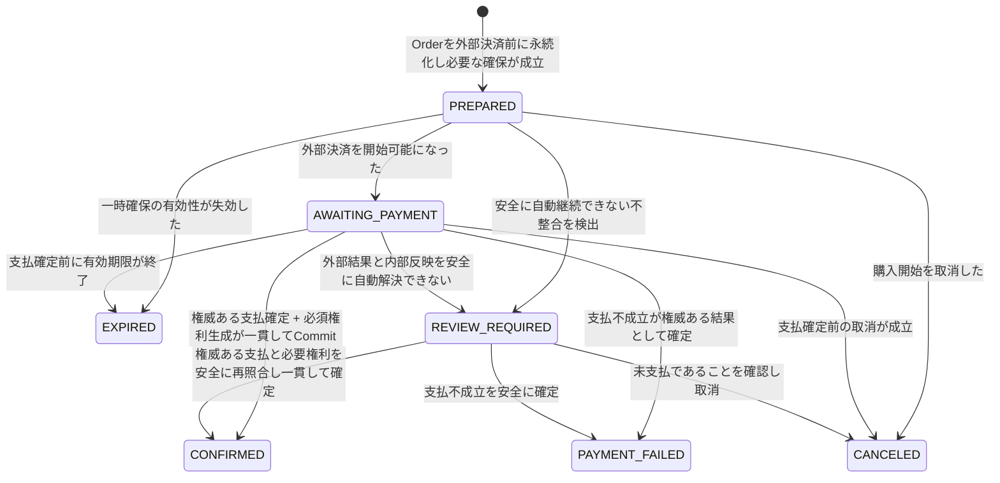

### 11.6 Checkout開始失敗とWebhook反映待ち

- 外部Checkoutの開始に失敗しても、Orderを削除しない。
- Checkoutがまだ成立していない場合、Orderは `PREPARED` に留まり、安全に再試行可能である。
- Checkout開始後、支払確定のDomain反映を待つ間は `AWAITING_PAYMENT` とする。
- Browserが外部決済の成功画面から戻っただけでは `CONFIRMED` へ遷移しない。
- 外部では支払成功が確認できるが内部確定処理を安全に適用できない場合、通常成功として扱わず `REVIEW_REQUIRED` を用いることができる。

外部Event別の状態観測、Checkout期限、Webhook retryは `SPEC-070`、Recovery policyは `SPEC-150` が定義する。

### 11.7 Order Business Rules

| Rule ID | Precondition / Rule / Result | 関連FR | 関連Invariant |
|---|---|---|---|
| BR-ORD-001 | 購入者が認証済みで販売Ruleを満たす場合、外部決済遷移前にOrderを `PREPARED` として永続化しなければならない。永続化失敗時は外部決済へ進めない。 | FR-TKT-007〜010, FR-KRK-013, FR-GDS-007, FR-XFN-009, FR-XFN-027 | INV-010-01 |
| BR-ORD-002 | OrderのCustomerはServer-sideで解決したBusiness Profileとし、Client指定Ownerを採用してはならない。 | FR-TKT-008, FR-XFN-003, FR-XFN-017 | INV-010-08 |
| BR-ORD-003 | Orderの金額はOrder ItemのServer-side価格Snapshotから計算し、Clientのprice / totalを権威値にしてはならない。 | FR-TKT-004, FR-KRK-014, FR-GDS-005, FR-XFN-016 | INV-010-09 |
| BR-ORD-004 | `PREPARED` / `AWAITING_PAYMENT` のOrderだけが未確定購入として扱われ、Ticket / Reservation / Goods履行権を有効に提供してはならない。 | FR-TKT-017〜018, FR-KRK-027, FR-XFN-028〜029 | INV-010-07 |
| BR-ORD-005 | Orderを `CONFIRMED` へ遷移させるDomain Triggerは「権威ある外部決済結果により支払が確定し、必須Domain更新を一貫してCommitできること」である。Browser redirectをTriggerにしてはならない。 | FR-TKT-011〜012, FR-KRK-017, FR-GDS-009, FR-XFN-010〜011 | INV-010-02, INV-010-07 |
| BR-ORD-006 | `CONFIRMED` 遷移は冪等であり、同一Orderに同じ支払確定が再入力されても2回目以降は既存の確定結果・既存権利を再利用し、新しい権利を生成してはならない。 | FR-TKT-013, FR-KRK-020, FR-GDS-010, FR-XFN-012〜013 | INV-010-02, INV-010-03, INV-010-10 |
| BR-ORD-007 | Order確定と必須権利生成の一部だけを成功としてCommitしてはならない。必須更新の一つでも成立しない場合、Orderを `CONFIRMED` として見せない。 | FR-TKT-016, FR-KRK-018〜023, FR-XFN-021 | INV-010-07 |
| BR-ORD-008 | `CONFIRMED`、`PAYMENT_FAILED`、`CANCELED`、`EXPIRED` から `PREPARED` / `AWAITING_PAYMENT` へ戻す通常遷移は禁止する。新しい購入試行は新しいOrderとして作成する。 | FR-XFN-012, FR-XFN-027〜028 | INV-010-02, INV-010-10 |
| BR-ORD-009 | 支払前に `CANCELED` / `EXPIRED` / `PAYMENT_FAILED` へ遷移するとき、そのOrderに属するEntry / Goods AllocationおよびKaraoke HoldはDomain Ruleに従い解放しなければならない。 | FR-KRK-016, FR-GDS-017, FR-XFN-027〜028 | INV-010-04, INV-010-07 |
| BR-ORD-010 | 外部支払結果と内部状態を安全に自動解決できない場合、既存確定データを削除せず `REVIEW_REQUIRED` または対応するConsistency Review Caseとして追跡可能にする。 | FR-ADM-021, FR-XFN-020〜021, FR-XFN-032 | INV-010-01, INV-010-07, INV-010-10 |
| BR-ORD-011 | `CONFIRMED` OrderのOrder Item内容、Customer、購入数量、購入時金額を販売設定変更で遡及的に変更してはならない。 | FR-MYP-007〜010, FR-ADM-002〜006, FR-XFN-023 | INV-010-01 |
| BR-ORD-012 | Order Purposeは作成後不変であり、Karaoke Orderは1 Orderにつき1排他的Karaoke Slotだけを対象とする。 | FR-KRK-004, FR-KRK-013〜019 | INV-010-04, INV-010-07 |

### 11.8 Orderの禁止遷移

明示された許可遷移以外はすべて禁止する。特に以下を禁止する。

- `PREPARED -> CONFIRMED` を、権威ある支払確定と必須権利生成なしで直接成立させる
- `CONFIRMED -> AWAITING_PAYMENT`
- `CONFIRMED -> PAYMENT_FAILED`
- `PAYMENT_FAILED -> CONFIRMED` を同一Orderの通常処理で行う
- `CANCELED -> CONFIRMED`
- `EXPIRED -> CONFIRMED`
- `CONFIRMED` を再確定して新規Ticket / Reservation / Inventory消費を追加する

返金・取消後の業務権利状態はOrder自体を支払前状態へ巻き戻さず、対象Ticket / Reservation / Goods Order Item側の取消状態として表現する。金融上のRefund lifecycleは `SPEC-070` がCanonical Ownerである。

## 12. Entry Ticket Domain

### 12.1 Entry Sales Allocation

販売数量上限があるEntry Ticket Offeringでは、支払確定時点だけで容量を消費すると、複数Customerが同じ残数を前提に同時Checkoutへ進み、外部支払成功後に権利を発行できない状態が発生し得る。

これを防ぐため、有限容量のEntry Ticket購入では、Orderを `PREPARED` とする時点で購入数量に対応する `Entry Sales Allocation` を確保する。

AllocationのCanonical Stateは以下とする。

- `HELD`: 当該Orderのために一時確保中。新規販売可能数から差し引く
- `COMMITTED`: Order `CONFIRMED` により正規販売として確定。対応Entry Ticket発行済み
- `RELEASED`: 支払前取消・失効・失敗等により再販売可能数へ戻した

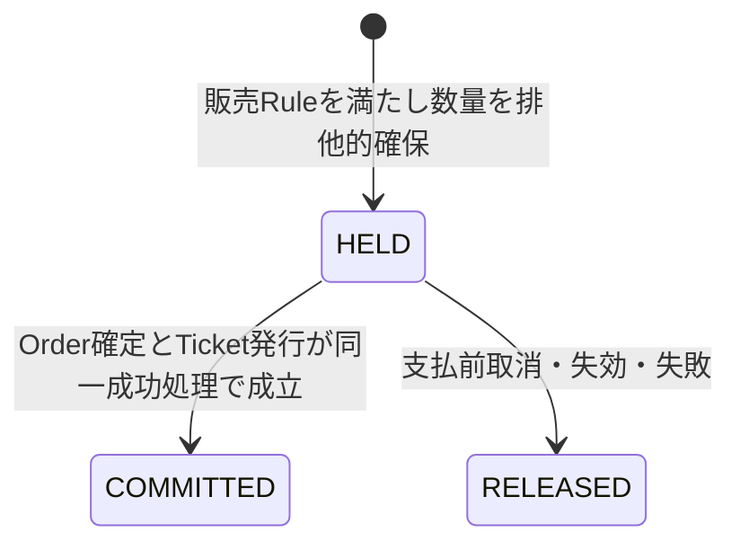

`COMMITTED` / `RELEASED` はTerminalであり、同じAllocationを再度 `HELD` に戻さない。

Entry Ticket Offeringの購入可能数量はDomain上、少なくとも以下を満たす。

```text
active_held_quantity + committed_quantity <= sales_capacity
```

### 12.2 Entry Ticketの発行単位

Entry Ticketは1名分の入場権を表す。

購入数量 `N` の `Entry Ticket Order Item` が `CONFIRMED` になった場合、正規に `N` 個のEntry Ticketを生成する。

各Ticketは、元Order Item内の購入数量単位に対して一意に対応しなければならない。例えば数量3の明細であれば、3つの異なる正規発行単位が存在する。Webhook再送等により同じ発行単位から2枚目のTicketを作成することは禁止する。

### 12.3 Entry Ticket State

| State | 意味 | Terminal |
|---|---|---|
| `VALID` | 正規発行済みで、現在Check-inに利用可能な権利 | No |
| `USED` | Entry Check-inが一度成立し、再利用不可 | Yes |
| `CANCELED` | 明示的な取消により利用権を失った | Yes |
| `EXPIRED` | 入場可能期間の終了等、Domain上の有効期間終了により利用不可 | Yes |

初期Stateは `VALID` とする。支払未確定の段階ではEntry Ticket Entity自体を有効権利として発行しない。

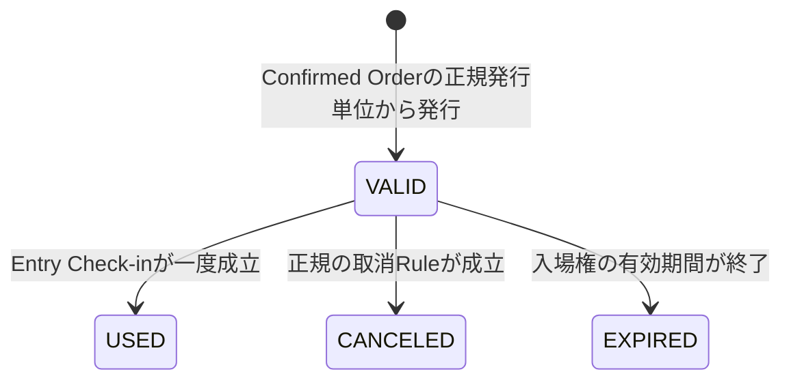

`USED`、`CANCELED`、`EXPIRED` から `VALID` へ戻す通常遷移は禁止する。例外的な権利復旧Capabilityを将来導入する場合は `SPEC-080` / `SPEC-130` で明示的な認可と監査を定義し、本書の二重利用Invariantを破ってはならない。

### 12.4 Entry Ticket Business Rules

| Rule ID | Precondition / Rule / Result | 関連FR | 関連Invariant |
|---|---|---|---|
| BR-TKT-001 | Entry Ticket新規購入ではOfferingが `ENABLED`、Sales Period内、必要数量が確保可能、Purchase Limit内でなければならない。 | FR-TKT-001〜006, FR-PUB-007, FR-PUB-010 | INV-010-09 |
| BR-TKT-002 | 有限販売数量のOfferingではOrder `PREPARED` と同時に必要数量を `HELD` Allocationとして確保し、確保できない場合は購入を開始してはならない。 | FR-TKT-005〜007, FR-TKT-025 | INV-010-01, INV-010-07, INV-010-10 |
| BR-TKT-003 | 全 `HELD` + `COMMITTED` 数量はOfferingのsales capacityを超えてはならない。並行購入・retryでも同じである。 | FR-TKT-025, FR-XFN-026 | INV-010-10 |
| BR-TKT-004 | 同一Business Profileの確定済みTicket数と有効Allocation数量の合計はPurchase Limitを超えてはならない。 | FR-TKT-026 | INV-010-10 |
| BR-TKT-005 | Order `CONFIRMED` 時、Allocationを `COMMITTED` にし、Order Item quantityと同数のEntry Ticketを同じ一貫した業務更新として発行する。 | FR-TKT-014〜016 | INV-010-03, INV-010-07 |
| BR-TKT-006 | 各Entry Ticketは `(Order Item, 正規購入数量単位)` に対して最大1つだけ存在し、retryによる重複発行を禁止する。 | FR-TKT-015, FR-XFN-013 | INV-010-03, INV-010-10 |
| BR-TKT-007 | `CONFIRMED` 前のOrderから有効Entry Ticketを作成・表示してはならない。 | FR-TKT-017〜018, FR-XFN-028〜029 | INV-010-07 |
| BR-TKT-008 | Entry TicketのOwnerは対応Order Customerと一致し、通常操作で変更してはならない。 | FR-TKT-019〜023, FR-MYP-003〜004 | INV-010-08 |
| BR-TKT-009 | `VALID` Ticketだけが通常のEntry Check-in対象であり、`USED` / `CANCELED` / `EXPIRED` は受付不能である。 | FR-STF-003〜007, FR-XFN-030〜031 | INV-010-05 |
| BR-TKT-010 | Entry Ticket取消はTicket stateを `CANCELED` にする明示的なDomain操作であり、Orderを支払前状態へ巻き戻さない。 | FR-TKT-024 | INV-010-01, INV-010-05 |
| BR-TKT-011 | Entry Ticket取消後に販売容量を回復させる場合、取消が権利回復可能な販売枠を実際に返還することを対象Cancellation policyが認める場合だけ行う。Refund単独を自動的な容量回復根拠にしてはならない。 | FR-TKT-024, FR-ADM-020 | INV-010-07 |

取消・返金条件の業務入口、RefundとのMappingは `SPEC-070`、Ticket lifecycleの詳細な受付有効期間・QRは `SPEC-080` が定義する。

## 13. Karaoke Slot / Hold Domain

### 13.1 Karaoke Slotの時間モデル

各Karaoke Slotは少なくとも以下の3時刻を論理的に持つ。

- `usage_start`: Customerが利用を開始する時刻
- `usage_end`: Customerの利用時間が終了する時刻
- `cycle_end`: 整備時間が終了し、当該Slotの占有が終了する時刻

必ず以下を満たす。

```text
usage_start < usage_end <= cycle_end
```

標準Slotは以下である。

```text
usage_end - usage_start = 15分
cycle_end - usage_end = 5分
```

販売・利用上の排他的占有区間は `[usage_start, cycle_end)` とする。Customerに表示する予約利用時間は `[usage_start, usage_end)` とする。

### 13.2 Slot重複

同一排他リソースに属する2つのKaraoke Slotは、販売可能または販売済みとして扱う場合、その排他的占有区間が重複してはならない。

排他リソースの具体的な識別単位（部屋、機材単位等）は `SPEC-090` が定義するが、Slotごとに排他Scopeを判定できなければならない。

### 13.3 Karaoke Slot State

| State | 意味 | Terminal |
|---|---|---|
| `AVAILABLE` | 新規Holdの対象になり得る未販売Slot | No |
| `HELD` | 1つの有効なKaraoke Holdに排他的に確保され、他Customerへ販売不可 | No |
| `SOLD` | 1つの確定Karaoke Reservationへ販売済み | Yes for normal sale lifecycle |
| `SALES_STOPPED` | 未販売だがAdministrator等により新規販売を停止 | No |

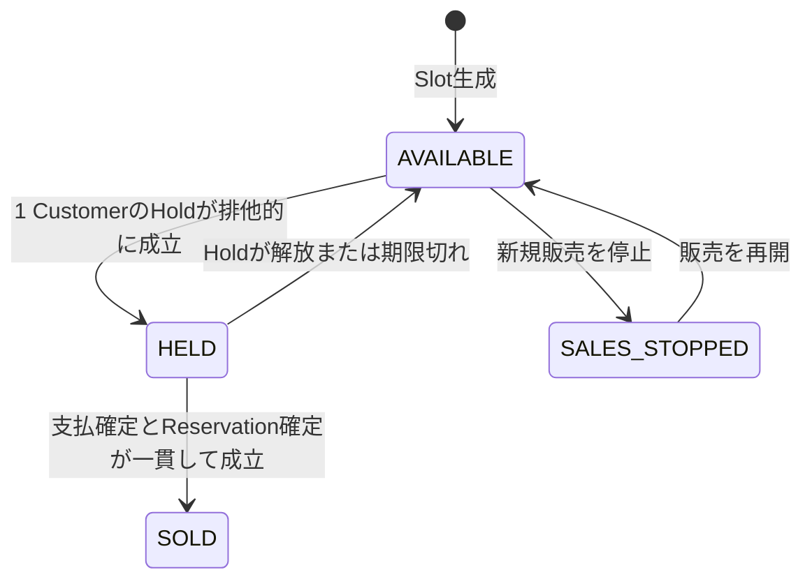

通常操作では `SOLD -> AVAILABLE`、`SOLD -> SALES_STOPPED` を行わない。確定Reservationを取消して再販売する業務が将来必要な場合は、Reservation取消とSlot再販売可否を一体の明示的Domain operationとして定義しなければならない。

### 13.4 Karaoke Hold

`Karaoke Hold` はReservationではない。支払確定前にSlotの排他性を守る一時確保である。

Holdは以下と一意に関連する。

- 1 Business Profile
- 1 Karaoke Slot
- 1 Karaoke Order / Karaoke Order Item

Hold Stateは以下とする。

- `ACTIVE`: 現在有効で、Slotを排他的に確保している
- `COMMITTED`: Order確定によりReservationへ変換済み
- `RELEASED`: 明示的取消・支払失敗等で解放済み
- `EXPIRED`: hold期限経過により解放済み

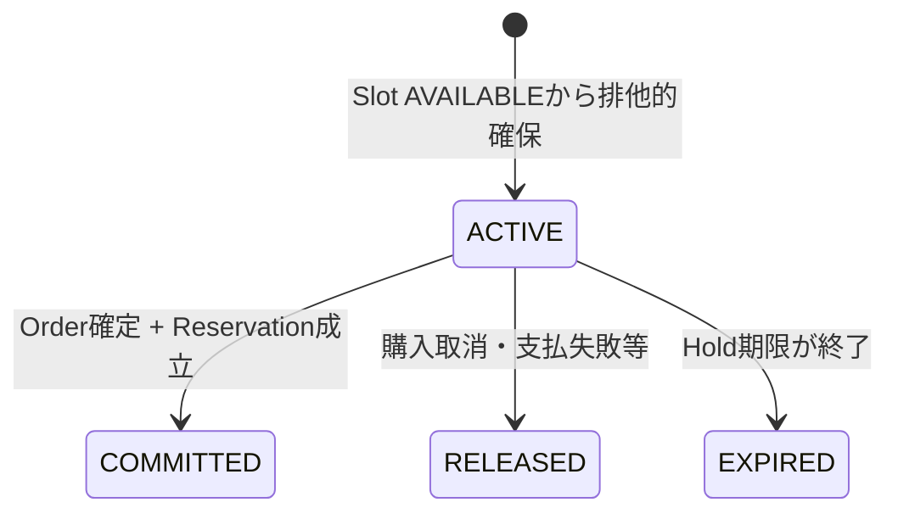

`ACTIVE` 以外のHoldはSlotの販売を妨げない。ただし `COMMITTED` Holdに対応するSlotは `SOLD` であるため再販売不可である。

Holdの具体秒数、期限計算、Checkout期限との具体同期方法は `SPEC-090` / `SPEC-070` が定義する。

### 13.5 Karaoke Slot編集Rule

AdministratorがSlotを編集する場合、既存の権利を暗黙に不整合へしてはならない。

- `AVAILABLE` / `SALES_STOPPED`: 時間・販売属性等、`SPEC-090` / `SPEC-130` で変更可能と定義された属性を変更してよい。ただし変更後も他Slotと排他的占有区間が重複してはならない。
- `HELD`: Holdの購入条件を変える時間・価格・排他Scope等の権利影響属性は通常編集してはならない。販売停止要求がある場合も、現在のHoldを黙って奪わない。
- `SOLD`: Reservationの利用時刻、排他Scope、Customer等、確定権利の意味を変える属性を通常のSlot編集で変更してはならない。表示補助等、権利意味を変えない属性だけを変更可能とする。

確定Reservationの変更・取消が必要な場合は、Slot編集ではなく明示的なReservation operationとして扱う。

### 13.6 Karaoke Slot / Hold Business Rules

| Rule ID | Precondition / Rule / Result | 関連FR | 関連Invariant |
|---|---|---|---|
| BR-KRK-001 | 標準Karaoke Slotは利用15分 + 整備5分の20分サイクルを表現できなければならない。 | FR-KRK-005〜006 | - |
| BR-KRK-002 | Slotの排他的占有区間は `[usage_start, cycle_end)` とし、同一排他Scopeで販売可能なSlot同士を重複させてはならない。 | FR-KRK-002〜006, FR-KRK-028 | INV-010-04 |
| BR-KRK-003 | Karaoke購入開始時、Slotが `AVAILABLE`、販売期間内、販売停止でなく、Purchase Limit内であることをServer-sideで再評価する。 | FR-KRK-007〜010, FR-XFN-026 | INV-010-04, INV-010-08 |
| BR-KRK-004 | 同一Slotについて同時に成立可能な `ACTIVE` Holdは最大1つとする。競合要求は最大1件だけ成功する。 | FR-KRK-010〜012 | INV-010-04, INV-010-10 |
| BR-KRK-005 | Slotが `HELD` の間は、Hold Owner以外を含む新規購入者へ販売可能として扱ってはならない。 | FR-KRK-011〜012 | INV-010-04 |
| BR-KRK-006 | `ACTIVE` Holdが `RELEASED` / `EXPIRED` になった場合、他の禁止条件がなければSlotを `AVAILABLE` へ戻して再販売可能にする。 | FR-KRK-016 | INV-010-04 |
| BR-KRK-007 | Holdの具体期限が終了した後、そのHoldを支払確定権利として使用してはならない。期限後の外部支払結果は `SPEC-070` / `SPEC-090` のRecovery Ruleで安全に扱う。 | FR-KRK-016, FR-XFN-021 | INV-010-04, INV-010-07 |
| BR-KRK-008 | Slot `HELD -> SOLD` は、同じHoldに結び付くOrderの権威ある支払確定、Reservation生成、Karaoke Ticket生成と一貫して成立しなければならない。 | FR-KRK-017〜023 | INV-010-03, INV-010-04, INV-010-07 |
| BR-KRK-009 | 同一排他的Slotに `SOLD` として成立可能なKaraoke Reservationは最大1件である。 | FR-KRK-019〜021 | INV-010-04 |
| BR-KRK-010 | Purchase Limit判定では確定Reservationと同一Profileの `ACTIVE` Holdを合算し、並行購入による制限回避を許さない。 | FR-KRK-007, FR-KRK-009〜012 | INV-010-10 |
| BR-KRK-011 | `SOLD` Slotの権利影響属性を通常編集して既存Reservationの日時・排他性を変更してはならない。 | FR-KRK-029〜030, FR-ADM-011〜012, FR-ADM-020 | INV-010-04, INV-010-07 |
| BR-KRK-012 | `SALES_STOPPED` は新規Holdを禁止するが、既存Reservationを取消さない。 | FR-KRK-030, FR-ADM-012 | INV-010-04, INV-010-07 |

## 14. Karaoke Reservation Domain

### 14.1 Reservationの意味とCardinality

Karaoke Reservationは、Customerが特定Karaoke Slotを利用する確定済み権利である。

Cardinalityは以下とする。

```text
Karaoke Order Item 1 ─── 0..1 Karaoke Reservation
Karaoke Slot       1 ─── 0..1 Karaoke Reservation
Business Profile   1 ─── 0..* Karaoke Reservation
```

支払未確定時にはReservationを確定権利として作成しない。支払前の排他確保はKaraoke Holdが表す。

### 14.2 Reservation State

Reservation Stateは以下とする。

- `CONFIRMED`: 支払確定済みで、対象Slotの利用権が有効
- `CANCELED`: 明示的な取消によりReservation権利を失った

Reservationの「利用済み」はKaraoke Ticket / Karaoke Check-inから導出し、Reservation自身へ重複した `USED` stateを持たせない。これによりTicket StateとReservation Stateの二重管理を避ける。

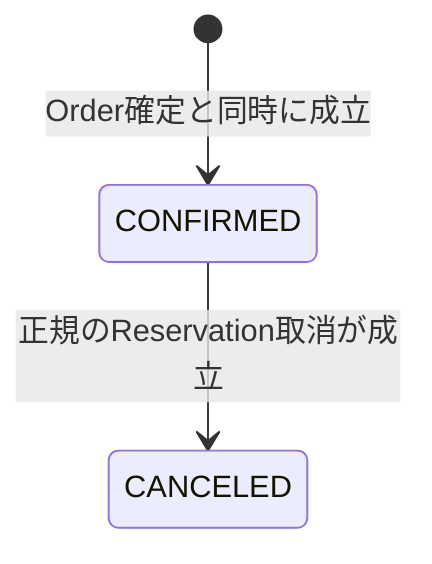

### 14.3 Reservation日時

Reservationの利用日時は対応Slotの確定時点の `usage_start` / `usage_end` を基準とする。Slotが `SOLD` になった後、通常のSlot編集でこれらを変更しないため、Reservation日時は安定して参照できる。

必要に応じて購入時の時間Snapshotを保持する物理方式は `SPEC-100` が定義する。

### 14.4 Reservation Business Rules

| Rule ID | Rule | 関連FR | 関連Invariant |
|---|---|---|---|
| BR-KRK-013 | Reservationは支払確定済みOrderからのみ作成し、支払前HoldをReservationとして表示してはならない。 | FR-KRK-018, FR-KRK-024, FR-KRK-027 | INV-010-07 |
| BR-KRK-014 | 同一Karaoke Order Itemから作成可能なReservationは最大1件とし、retryで重複生成しない。 | FR-KRK-020 | INV-010-02, INV-010-10 |
| BR-KRK-015 | Reservation CustomerはOrder Customerと一致し、Slotは対応HoldのSlotと一致しなければならない。 | FR-KRK-018〜021, FR-KRK-024 | INV-010-04, INV-010-08 |
| BR-KRK-016 | 1つの排他的Slotに `CONFIRMED` Reservationを複数成立させてはならない。 | FR-KRK-021 | INV-010-04 |
| BR-KRK-017 | Reservation取消は対応Karaoke Ticketを利用不可へ遷移させなければならず、Ticketが既に `USED` の場合は通常取消として扱わない。 | FR-KRK-024〜026, FR-STF-009〜013 | INV-010-05, INV-010-07 |
| BR-KRK-018 | ReservationのCustomer / Slot / 利用時刻を通常の所有権移転やSlot編集で差し替えてはならない。 | FR-KRK-029, FR-ADM-011〜013 | INV-010-04, INV-010-08 |

RefundがReservation取消へ結び付く条件、取消後Slotを再販売するかどうかは `SPEC-070` / `SPEC-090` が詳細化する。ただし再販売する場合も、元Reservationを履歴から削除してはならない。

## 15. Karaoke Ticket Domain

### 15.1 Cardinality

```text
Karaoke Reservation 1 ─── 1 Karaoke Ticket
```

`CONFIRMED` Reservationには正規のKaraoke Ticketが必ず1つ存在しなければならない。同一Reservationから2つ以上のKaraoke Ticketを発行してはならない。

### 15.2 Karaoke Ticket State

| State | 意味 | Terminal |
|---|---|---|
| `VALID` | Reservationに対応する有効な受付権 | No |
| `USED` | Karaoke Check-inが一度成立済み | Yes |
| `CANCELED` | Reservation取消等により無効 | Yes |
| `EXPIRED` | 受付可能期間が終了し未使用のまま無効 | Yes |

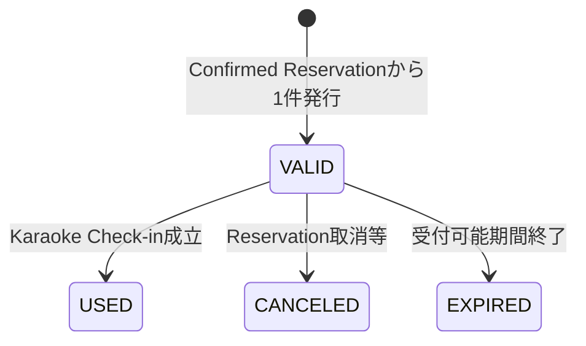

受付可能期間の具体的な前後許容時間は `SPEC-080` / `SPEC-090` が定義する。

### 15.3 Karaoke Ticket Business Rules

| Rule ID | Rule | 関連FR | 関連Invariant |
|---|---|---|---|
| BR-KRK-019 | `CONFIRMED` Reservationの成立時にKaraoke Ticketを1件発行し、Order確定と同じ一貫したBusiness Transactionに含める。 | FR-KRK-022〜023 | INV-010-03, INV-010-07 |
| BR-KRK-020 | 同一Reservationに対応するKaraoke Ticketは常に最大1件であり、retry / 外部再送で重複発行しない。 | FR-KRK-023, FR-XFN-013 | INV-010-03, INV-010-10 |
| BR-KRK-021 | Karaoke Ticket OwnerはReservation Customerと一致し、通常操作で変更しない。 | FR-KRK-024〜025, FR-MYP-005〜006 | INV-010-08 |
| BR-KRK-022 | Entry TicketとKaraoke Ticketは異なるDomain Typeであり、一方を他方のCheck-inへ使用できない。 | FR-KRK-026, FR-STF-014, FR-XFN-018 | INV-010-05 |
| BR-KRK-023 | Karaoke Ticketが `VALID` であり、Reservationが `CONFIRMED` であり、Domain上の受付時間条件を満たす場合だけ通常Check-in可能とする。 | FR-STF-009〜013, FR-STF-015 | INV-010-05 |
| BR-KRK-024 | Reservationが `CANCELED` になった場合、未使用Karaoke Ticketを `CANCELED` にし、受付可能として残してはならない。 | FR-KRK-024〜026, FR-STF-011 | INV-010-05, INV-010-07 |

## 16. Goods / Inventory Domain

### 16.1 Goods Inventory

`Goods Inventory` はGoodsごとの販売可能数量と、支払前確保・確定販売の整合性を管理するDomain概念である。

Domain上、少なくとも以下の数量を区別する。

- `saleable_capacity`: 運営が販売可能として設定した総数量
- `held_quantity`: 有効なGoods Sales Allocationとして支払前に確保中の数量
- `committed_quantity`: 支払確定済みとして販売済みの数量

常に以下を満たさなければならない。

```text
held_quantity >= 0
committed_quantity >= 0
held_quantity + committed_quantity <= saleable_capacity
```

### 16.2 Goods Sales Allocation

Goods購入では、Order `PREPARED` の成立時に必要数量を支払前Allocationとして確保する。

Stateは以下とする。

- `HELD`: 支払前確保中
- `COMMITTED`: 支払確定済み販売へ変換済み
- `RELEASED`: 支払前取消・失効・失敗等により在庫へ戻した

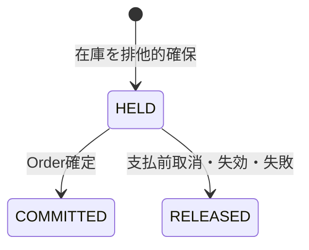

### 16.3 Goods Order Item State

Goods Order Itemは購入履歴上の明細であると同時に、会場受け渡し対象となる業務権利を持つ。

Stateは以下とする。

- `PENDING_PAYMENT`: Order未確定。受け渡し不可
- `FULFILLABLE`: Order確定済みで、会場受け渡し可能
- `CANCELED`: 正規の取消により受け渡し不可

`PENDING_PAYMENT -> FULFILLABLE` はOrder `CONFIRMED` と同時に成立する。

`FULFILLABLE -> CANCELED` は、対象Goodsが未受け渡しであり、下流仕様で定義される正規の取消条件を満たす場合だけ許可する。

### 16.4 在庫復元

- `HELD` Allocationが支払前に `RELEASED` になる場合、数量は販売可能在庫へ戻る。
- `COMMITTED` AllocationはRefundの存在だけで自動的に在庫へ戻さない。
- 確定済みGoods Order Itemが正規に `CANCELED` され、かつHandoffが未完了である場合、取消Ruleが在庫復元対象と定義するなら確定販売数量を減らし再販売可能在庫へ戻してよい。
- Handoff `COMPLETED` 後は通常の自動在庫復元を禁止する。返品等を将来導入する場合は別の明示的Domain Ruleが必要である。

### 16.5 Goods Business Rules

| Rule ID | Precondition / Rule / Result | 関連FR | 関連Invariant |
|---|---|---|---|
| BR-GDS-001 | Goods購入開始時、Goodsが販売可能状態・Sales Period内であり、必要数量の在庫を確保可能でなければならない。 | FR-GDS-001〜006 | INV-010-09 |
| BR-GDS-002 | Goods Orderを `PREPARED` とする時点で必要数量を `HELD` Allocationとして確保し、確保失敗時はCheckoutへ進めない。 | FR-GDS-005〜007, FR-GDS-011, FR-GDS-017 | INV-010-01, INV-010-07 |
| BR-GDS-003 | `held_quantity + committed_quantity` は常に `saleable_capacity` 以下でなければならず、並行購入・retryでも在庫超過を成立させない。 | FR-GDS-011, FR-GDS-017 | INV-010-10 |
| BR-GDS-004 | Order確定時、対応Allocationを `COMMITTED` とし、Goods Order Itemを `FULFILLABLE` にする処理を一貫して成立させる。 | FR-GDS-009〜013 | INV-010-02, INV-010-07 |
| BR-GDS-005 | 支払未完了のGoods Order Itemは `PENDING_PAYMENT` であり、会場受け渡し対象として扱ってはならない。 | FR-GDS-013〜015, FR-XFN-028〜029 | INV-010-07 |
| BR-GDS-006 | 支払前Orderが `CANCELED` / `EXPIRED` / `PAYMENT_FAILED` になった場合、対応 `HELD` Allocationを `RELEASED` にして在庫を回復する。 | FR-GDS-017, FR-XFN-027〜028 | INV-010-07, INV-010-10 |
| BR-GDS-007 | Refund単独ではInventoryを自動復元しない。Goods Order Itemの正規取消と未受け渡しを確認した場合だけ在庫復元を成立させる。 | FR-GDS-014〜017, FR-ADM-017, FR-ADM-020 | INV-010-07 |
| BR-GDS-008 | Goods Order ItemのCustomerはOrder Customerと一致し、通常の所有権移転を許可しない。 | FR-GDS-012〜013, FR-MYP-009, FR-XFN-017 | INV-010-08 |
| BR-GDS-009 | Goodsの標準履行方式は会場受け取りであり、配送物流Entityを標準Domainへ追加しない。 | FR-GDS-013, FR-GDS-016 | - |

具体的なLock、Constraint、Isolation、在庫計数SQLは `SPEC-100`、支払・RefundとのMappingは `SPEC-070` が定義する。

## 17. Goods Handoff Domain

### 17.1 Handoff State

各 `Goods Order Item` は1つの `Goods Handoff` を持つ。

```text
Goods Order Item 1 ─── 1 Goods Handoff
```

Handoff Stateは以下とする。

- `PENDING`: まだ受け渡しされていない
- `COMPLETED`: 会場受け渡しが一度成立した
- `VOID`: Goods Order Item取消等により受け渡し対象外

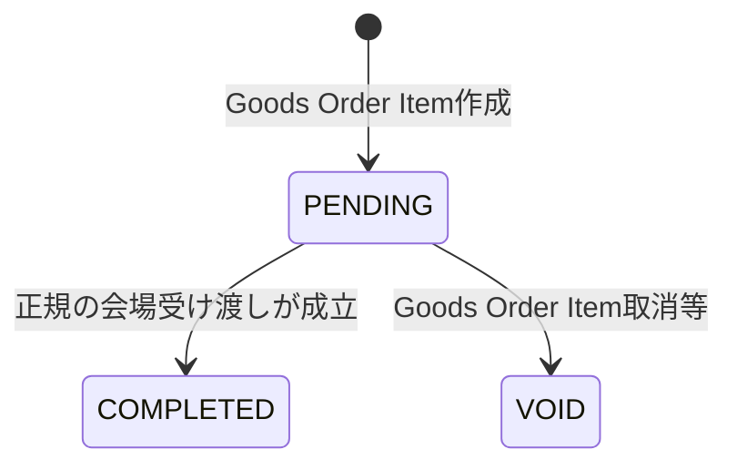

`COMPLETED` はTerminalである。通常操作で `COMPLETED -> PENDING` を許可しない。

### 17.2 Goods Handoff Business Rules

| Rule ID | Rule | 関連FR | 関連Invariant |
|---|---|---|---|
| BR-GDS-010 | Handoffを `COMPLETED` にできるのは、Goods Order Itemが `FULFILLABLE` で、Handoffが `PENDING` の場合だけとする。 | FR-GDS-013〜015 | INV-010-10 |
| BR-GDS-011 | 同一Goods Order ItemのHandoffを複数回 `COMPLETED` として成立させてはならない。retry時は既存完了結果を返せるが、新しい受け渡し完了を追加しない。 | FR-GDS-015 | INV-010-10 |
| BR-GDS-012 | Goods Order Itemが `CANCELED` の場合、Handoffを `VOID` とし、新規受け渡しを禁止する。 | FR-GDS-014〜015 | INV-010-07 |
| BR-GDS-013 | `COMPLETED` Handoffを持つGoods Order Itemを通常の取消操作で在庫復元対象にしてはならない。 | FR-ADM-017, FR-ADM-020 | INV-010-07 |

Staff / Administratorのうち誰がHandoff更新可能かは `SPEC-060` / `SPEC-130` が定義する。

## 18. Check-in Domain

### 18.1 Check-inの意味

Check-inは、一回限りのTicket利用権が正規に消費されたBusiness Eventである。

EntryとKaraokeは別Domain Eventとして扱う。

```text
Entry Ticket    1 ─── 0..1 Entry Check-in
Karaoke Ticket  1 ─── 0..1 Karaoke Check-in
```

Check-in Entityは成立後に状態遷移する作業Entityではなく、成立事実を表す不変のBusiness Eventとして扱う。

### 18.2 Entry Check-in

Entry Check-inのPreconditionは以下とする。

- Ticket種別がEntry Ticketである
- Entry Ticketが存在する
- Entry Ticket Stateが `VALID`
- 受付Actorが当該操作を行う権限を持つ
- Entry Ticketの有効期間等、`SPEC-080` が定義する受付条件を満たす

成功時は、Entry Check-inを1件作成し、同じ原子的Business operationでEntry Ticketを `USED` にする。

### 18.3 Karaoke Check-in

Karaoke Check-inのPreconditionは以下とする。

- Ticket種別がKaraoke Ticketである
- Karaoke Ticketが `VALID`
- 対応Reservationが `CONFIRMED`
- 対応Slot / Reservationの日時に対し、受付時間Ruleを満たす
- 受付Actorが当該操作を行う権限を持つ

成功時は、Karaoke Check-inを1件作成し、同じ原子的Business operationでKaraoke Ticketを `USED` にする。

### 18.4 Check-in Business Rules

| Rule ID | Rule | 関連FR | 関連Invariant |
|---|---|---|---|
| BR-CHK-001 | Entry Check-inとKaraoke Check-inは異なるDomain operationであり、Ticket typeが一致しない受付を成立させてはならない。 | FR-KRK-026, FR-STF-014, FR-XFN-018 | INV-010-05 |
| BR-CHK-002 | Check-inは対応Ticketが `VALID` の場合だけ成立し、`USED` / `CANCELED` / `EXPIRED` では成立しない。 | FR-STF-003〜006, FR-STF-009〜012, FR-XFN-030〜031 | INV-010-05 |
| BR-CHK-003 | Check-in作成とTicket `VALID -> USED` は同一の原子的Business operationとして成立しなければならない。 | FR-STF-004, FR-STF-007, FR-STF-010, FR-STF-013, FR-XFN-015 | INV-010-05, INV-010-07 |
| BR-CHK-004 | 1 Ticketにつき対応Check-inは最大1件とし、並行Scan・retryで複数成立させてはならない。 | FR-STF-006〜007, FR-STF-012〜013, FR-XFN-015 | INV-010-05, INV-010-10 |
| BR-CHK-005 | 既に `USED` のTicketへのretryは新規Check-inを作らず、既存の利用済み結果として扱う。 | FR-STF-006〜007, FR-STF-012〜013, FR-XFN-031 | INV-010-05, INV-010-10 |
| BR-CHK-006 | `CANCELED` / `EXPIRED` TicketはCheck-in不可であり、受付不能のまま状態を変えない。 | FR-STF-005, FR-STF-011, FR-XFN-030 | INV-010-05 |
| BR-CHK-007 | Karaoke Check-inではReservation日時に基づく受付可否を判定し、通常Rule外の例外受付は明示的な別Capabilityなしに成立させない。 | FR-STF-009〜010, FR-STF-015 | INV-010-05, INV-010-08 |
| BR-CHK-008 | Check-in対象のOwner情報はTicketから導出する。StaffがOwnerを指定してCheck-in対象を差し替えることを許可しない。 | FR-STF-003, FR-STF-009, FR-STF-016 | INV-010-08 |

QR Token形式、Token hash、Scan Request、競合SQLは `SPEC-080` がCanonical Ownerである。

## 19. Notification Domain

### 19.1 Notification Requestの責務

`Notification Request` は、確定済みBusiness Transactionの結果を通知するための再試行可能な要求であり、Order / Ticket / Reservation等の確定条件そのものではない。

通知要求は少なくとも以下の論理関係を持つ。

- 通知種別
- Recipient
- 発生元Business Event / Entity
- 通知内容を再生成または追跡するための参照
- 現在のNotification State

### 19.2 Notification State

- `PENDING`: 送信要求が永続化済みで、配送成功は未確認
- `SENT`: 外部Providerへの送信処理が成功扱いとなった
- `FAILED_RETRYABLE`: 送信失敗が記録され、Business Transactionを再実行せず再試行可能
- `CANCELED`: 業務上送信不要と判断された未送信要求。既存購入権利を変更しない

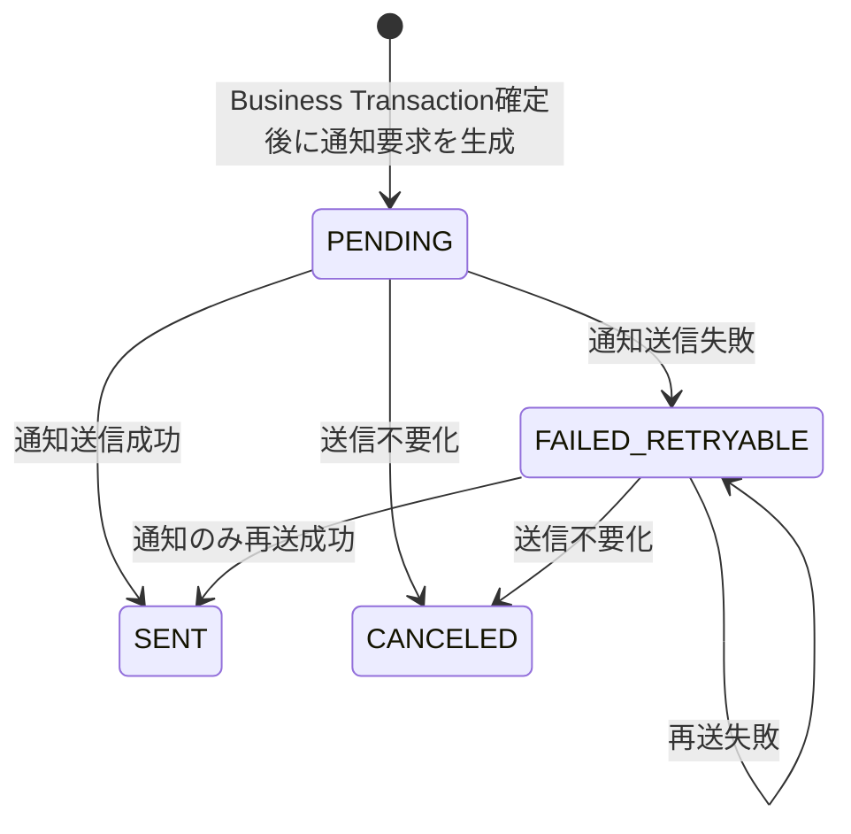

### 19.3 Notification Business Rules

| Rule ID | Rule | 関連FR | 関連Invariant |
|---|---|---|---|
| BR-NTF-001 | 購入・予約確定通知は対応Business Transactionが正常Commitした後に送信対象として生成する。 | FR-EML-002〜006 | INV-010-06, INV-010-07 |
| BR-NTF-002 | Notification送信成功をOrder `CONFIRMED`、Ticket発行、Reservation確定、Goods購入成立のPreconditionにしてはならない。 | FR-EML-006〜007, FR-XFN-019 | INV-010-06 |
| BR-NTF-003 | Email送信失敗時はNotificationだけを `FAILED_RETRYABLE` にし、確定済みOrder / Ticket / Reservation / Goods Order ItemをRollback・削除・取消してはならない。 | FR-EML-007, FR-EML-010〜011, FR-XFN-019〜020 | INV-010-01, INV-010-06 |
| BR-NTF-004 | Notification retryはNotification Stateだけを更新し、発生元Business Transactionを再確定してはならない。 | FR-EML-008〜009 | INV-010-02, INV-010-03, INV-010-06, INV-010-10 |
| BR-NTF-005 | 同一の論理通知をretryする場合、元Business Eventとの一意な対応を維持し、新しい購入権利を生成しない。 | FR-EML-008〜009 | INV-010-10 |
| BR-NTF-006 | Email未達でもCustomerはBusiness Databaseの確定済みOrder / Ticket / Reservation / Goods購入を参照可能でなければならない。 | FR-EML-011, FR-MYP-003〜010 | INV-010-01, INV-010-06 |

Template、Provider、Retry回数、Backoffは `SPEC-120` / `SPEC-150` が定義する。

## 20. 時刻・期間・空き状況のBusiness Rule

### 20.1 業務Timezone

すべてのイベント運営上の日時解釈は `Asia/Tokyo` を基準とする。

### 20.2 日付と日時

- 「対象日」は `Asia/Tokyo` のcalendar dateとして扱う。
- Sales Period、Order時刻、Slot開始・終了、Check-in時刻は日時として扱う。
- 日付だけの設定を暗黙に00:00 UTC等へ変換して業務境界としない。

### 20.3 販売期間境界

販売期間は `[starts_at, ends_at)` とする。

### 20.4 Karaoke Slot境界

- Customer利用区間: `[usage_start, usage_end)`
- 整備区間: `[usage_end, cycle_end)`
- 排他的占有区間: `[usage_start, cycle_end)`

隣接Slotは、先行Slotの `cycle_end` と次Slotの `usage_start` が一致してよい。この場合、区間は重複しない。

### 20.5 1時間単位表示への集約

日付・1時間単位の空き状況表示へ変換できるよう、Slotは自身の `usage_start` を基準として `Asia/Tokyo` の1時間bucketへ所属させる。

例として、`10:00 <= usage_start < 11:00` のSlotは10時台bucketへ属する。Slotが時間境界を跨いでも同じSlotを複数bucketへ重複計数しない。

1時間bucketの空き状況は、少なくともそのbucket内に属するSlot数と、`AVAILABLE` かつ販売可能なSlot数から導出できる。具体的なUI表現は `SPEC-050` が定義する。

### 20.6 Time Business Rules

| Rule ID | Rule | 関連FR |
|---|---|---|
| BR-XFN-001 | Business Timezoneは `Asia/Tokyo` とし、販売・Slot・受付の業務境界はこのTimezoneで解釈する。 | FR-PUB-002, FR-KRK-002〜006, FR-KRK-024 |
| BR-XFN-002 | Sales Periodは開始包含・終了非包含とする。 | FR-TKT-002, FR-KRK-007, FR-GDS-004 |
| BR-XFN-003 | Karaoke Slotの排他的占有は利用時間と整備時間の両方を含み、整備時間中に別Customer向けSlotを重ねて販売してはならない。 | FR-KRK-005〜006, FR-KRK-021 |
| BR-XFN-004 | 1時間単位の空き表示はSlot `usage_start` に基づくbucket集約で表現可能でなければならない。 | FR-KRK-002〜004 |

## 21. Failure / Recoveryに必要なDomain State

本章は、詳細Recovery手順ではなく、Domain上追跡すべき状態を定義する。

| Scenario | Domain上の表現 |
|---|---|
| Stripe遷移前 | Order `PREPARED` |
| Checkout開始失敗 | Orderは削除せず `PREPARED` に留まる。必要なAllocation / Holdが有効な限り再試行可能 |
| 決済未完了 | Order `AWAITING_PAYMENT`。有効Ticket / Reservation / Goods履行権は未成立 |
| Webhook反映待ち | Order `AWAITING_PAYMENT`。Browser success表示では確定しない |
| 権威ある支払成功だが内部反映を安全に自動完了できない | Order `REVIEW_REQUIRED` またはConsistency Review Caseを作成。確定済みを装わない |
| Karaoke hold期限切れ | Hold `EXPIRED`、Slotは他条件を満たせば `AVAILABLE` |
| Email送信失敗 | Notification `FAILED_RETRYABLE`。Business Transactionは維持 |
| 外部Service一時障害 | 既存確定Domain Stateを削除せず、対象Order / Notification / Consistency Review Case等で追跡 |
| 人手確認が必要な不整合 | Consistency Review Caseを作成し、対象Entityを削除・捏造せず照合対象として保持 |

### 21.1 Consistency Review Case

Consistency Review Caseは次の条件でのみ使用する。

- 自動retryを続けるだけでは二重確定・二重発行・二重販売の危険がある
- 外部権威情報と内部状態のどちらかを無視して成功/失敗へ決めるのが安全でない
- 既存の確定済み業務データを破壊せず人手確認が必要

このEntityは正常フローの常用状態にしてはならない。具体的なCase分類、解消手順、SLA、Runbookは `SPEC-150`、監査・観測項目は `SPEC-160` が定義する。

## 22. Domain Invariants

### 22.1 DI-030-001 Order Persistence Before External Payment

外部決済へ遷移可能な購入試行には、必ずBusiness Database上のOrderが先に存在する。

Supports: `INV-010-01`

### 22.2 DI-030-002 Exactly-once Logical Order Confirmation

同一Orderは論理的に最大1回だけ `CONFIRMED` となる。再送・retryは既存確定結果を再利用し、新しい確定効果を追加しない。

Supports: `INV-010-02`, `INV-010-10`

### 22.3 DI-030-003 Unique Entitlement Source

Entry Ticketは正規購入数量単位ごとに最大1件、Karaoke ReservationはKaraoke Order Itemごとに最大1件、Karaoke TicketはReservationごとに最大1件である。

Supports: `INV-010-03`, `INV-010-10`

### 22.4 DI-030-004 Entry Capacity Safety

Entry Ticket Offeringの有効Allocation数量と確定販売数量の合計は販売数量上限を超えない。

Supports: `INV-010-01`, `INV-010-10`

### 22.5 DI-030-005 Karaoke Slot Exclusivity

同一排他的Karaoke Slotには有効Holdを最大1件、確定Reservationを最大1件だけ成立させる。

Supports: `INV-010-04`, `INV-010-10`

### 22.6 DI-030-006 Goods Inventory Safety

Goodsの支払前確保数量と確定販売数量の合計は販売可能在庫を超えない。

Supports: `INV-010-10`

### 22.7 DI-030-007 Single-use Ticket

Entry TicketおよびKaraoke Ticketは最大1件の対応Check-inしか持たず、Check-in成立時に `VALID -> USED` を原子的に行う。

Supports: `INV-010-05`, `INV-010-10`

### 22.8 DI-030-008 Notification Independence

Notification失敗はOrder、Ticket、Reservation、Goods購入の確定状態をRollbackしない。

Supports: `INV-010-06`

### 22.9 DI-030-009 Atomic Entitlement Confirmation

Orderを `CONFIRMED` とする場合、当該Order Purposeに必須の権利生成・Allocation確定・Slot確定を中途半端に残さない。

Supports: `INV-010-07`

### 22.10 DI-030-010 Ownership Integrity

自己所有Domain DataのOwnerはServer-sideで検証したBusiness Profileとの関係で決まり、Client指定IDだけでは変更・参照できない。

Supports: `INV-010-08`

### 22.11 DI-030-011 Server-authoritative Pricing

Orderの金額はServer-sideの販売Configurationから決定した購入時Snapshotであり、Client入力だけで確定しない。

Supports: `INV-010-09`

### 22.12 DI-030-012 Retry-safe Domain Effects

外部再送、Client retry、通知retry、並行Scan等に対して、Domain effectは一意な業務原因へ結び付き、重複する権利・販売・受付を作らない。

Supports: `INV-010-10`

## 23. SPEC-010 System Invariant Traceability

| SPEC-010 Invariant | 主なEntity / State | 主なBusiness Rule / Domain Invariant |
|---|---|---|
| INV-010-01 購入情報を失わない | Order `PREPARED`, Allocation, Consistency Review Case | BR-ORD-001, BR-ORD-010, DI-030-001 |
| INV-010-02 Orderを二重確定しない | Order `CONFIRMED` | BR-ORD-005〜006, DI-030-002 |
| INV-010-03 Ticketを二重発行しない | Entry Ticket, Karaoke Reservation, Karaoke Ticket | BR-TKT-005〜006, BR-KRK-014, BR-KRK-019〜020, DI-030-003 |
| INV-010-04 Karaoke Slotを二重販売しない | Karaoke Slot `HELD/SOLD`, Karaoke Hold, Reservation | BR-KRK-002〜009, DI-030-005 |
| INV-010-05 QR Ticketを二重利用させない | Ticket `VALID/USED`, Check-in | BR-TKT-009, BR-KRK-023〜024, BR-CHK-001〜007, DI-030-007 |
| INV-010-06 Email失敗で購入確定をRollbackしない | Notification Request | BR-NTF-001〜006, DI-030-008 |
| INV-010-07 決済確定と権利発行を中途半端に残さない | Order `CONFIRMED`, Allocation, Reservation, Ticket | BR-ORD-005〜010, BR-TKT-005, BR-KRK-008, BR-GDS-004, DI-030-009 |
| INV-010-08 所有権と権限をServer-sideで検証する | Business Profile, all owned entities | BR-USR-001〜007, BR-ORD-002, BR-TKT-008, BR-KRK-021, BR-GDS-008, DI-030-010 |
| INV-010-09 金額をClient入力だけで確定しない | Sales Configuration, Order Item price snapshot | BR-SAL-001〜002, BR-ORD-003, DI-030-011 |
| INV-010-10 外部処理の再送に耐える | Order, Allocation, Hold, Ticket, Handoff, Notification | BR-ORD-006, BR-TKT-003〜006, BR-KRK-004〜010, BR-GDS-003, BR-GDS-011, BR-CHK-004〜005, BR-NTF-004〜005, DI-030-012 |

## 24. SPEC-020 Functional Requirement Traceability

本章は、Domain ModelまたはBusiness Ruleを必要とする `FR-*` を、本書のCanonical要素へ追跡する。純粋な画面Navigation、外部Provider内部処理、URL等は本書で再定義せず、対応するDomain前提だけを示す。

### 24.1 Public / Auth

| Requirement | Domain trace |
|---|---|
| FR-PUB-001〜006, FR-PUB-011 | Event, FAQ Item, Announcement, Publication State, BR-EVT-001〜004 |
| FR-PUB-007〜010 | Entry Ticket Offering, Karaoke Sales Configuration, Goods, Sale Control State, Sales Availability, BR-SAL-001〜005 |
| FR-PUB-012 | BR-USR-001, BR-SAL-005。認証UI詳細はSPEC-040/050/060 |
| FR-PUB-013〜014 | Domain data sourceはEvent / Sales Configuration。Failure UX / NavigationはSPEC-040/050 |
| FR-AUTH-001〜009 | Auth IdentityはSupabase Authの責務。Business Profileとの1:1関係はBR-USR-001 |
| FR-AUTH-010〜012 | Business Profile ownership, BR-USR-001, BR-USR-006 |
| FR-AUTH-013 | Customer導出Rule, BR-USR-002 |
| FR-AUTH-014 | 既存Domain state保持, BR-ORD-010, DI-030-001 |

### 24.2 Entry Ticket

| Requirement | Domain trace |
|---|---|
| FR-TKT-001〜006 | Entry Ticket Offering, Sales Period, Purchase Limit, BR-SAL-001〜006, BR-TKT-001 |
| FR-TKT-007〜010 | Order `PREPARED`, BR-ORD-001, BR-TKT-002 |
| FR-TKT-011〜013 | Order state machine, BR-ORD-005〜006 |
| FR-TKT-014〜016 | Entry Sales Allocation, Entry Ticket issuance unit, BR-TKT-005〜006, DI-030-003, DI-030-009 |
| FR-TKT-017〜018 | Order `AWAITING_PAYMENT`, BR-ORD-004, BR-TKT-007 |
| FR-TKT-019〜023 | Entry Ticket Owner, BR-USR-004〜006, BR-TKT-008 |
| FR-TKT-024 | Entry Ticket `CANCELED`, BR-TKT-010〜011 |
| FR-TKT-025 | Entry Sales Allocation, BR-TKT-002〜003, DI-030-004 |
| FR-TKT-026 | Purchase Limit, BR-SAL-006〜007, BR-TKT-004 |

### 24.3 Karaoke

| Requirement | Domain trace |
|---|---|
| FR-KRK-001〜004 | Karaoke Sales Configuration, Karaoke Slot time model, BR-XFN-004 |
| FR-KRK-005〜006 | `usage_start/usage_end/cycle_end`, BR-KRK-001〜002, BR-XFN-003 |
| FR-KRK-007〜009 | Sales Configuration, Purchase Limit, BR-KRK-003, BR-KRK-010 |
| FR-KRK-010〜012 | Karaoke Hold `ACTIVE`, Slot `HELD`, BR-KRK-004〜005, DI-030-005 |
| FR-KRK-013〜016 | Order, Karaoke Hold, BR-ORD-001, BR-ORD-009, BR-KRK-006〜007 |
| FR-KRK-017〜023 | Order confirmation, Slot `SOLD`, Reservation, Karaoke Ticket, BR-KRK-008〜009, BR-KRK-013〜020 |
| FR-KRK-024〜027 | Reservation / Karaoke Ticket ownership and state, BR-KRK-021〜024, BR-ORD-004 |
| FR-KRK-028〜030 | Slot generation/edit state rules, BR-KRK-001〜002, BR-KRK-011〜012 |
| FR-KRK-031 | Reservation / Order / Ticket relations defined in §§14–15 |
| FR-KRK-032 | Normal Domain invariant cannot be bypassed; exception authorization is SPEC-060/130 |

### 24.4 Goods

| Requirement | Domain trace |
|---|---|
| FR-GDS-001〜006 | Goods Sales Configuration, Goods Inventory, BR-GDS-001 |
| FR-GDS-007〜010 | Order state machine, BR-ORD-001, BR-ORD-005〜006, BR-GDS-004 |
| FR-GDS-011, FR-GDS-017 | Goods Sales Allocation, BR-GDS-002〜003, DI-030-006 |
| FR-GDS-012〜013 | Goods Order Item owner and `FULFILLABLE`, BR-GDS-008〜009 |
| FR-GDS-014〜015 | Goods Handoff, BR-GDS-010〜013 |
| FR-GDS-016 | BR-GDS-009 |

### 24.5 Mypage / Admin / Staff / Email

| Requirement | Domain trace |
|---|---|
| FR-MYP-001〜002, FR-MYP-012 | Business Profile ownership, BR-USR-001, BR-USR-006 |
| FR-MYP-003〜010 | Entry Ticket, Karaoke Reservation/Ticket, Order, Goods Order Item ownership relations |
| FR-MYP-011 | Business Profile, BR-USR-001 |
| FR-ADM-001, FR-ADM-019〜020 | Domain操作はBR-USR-007と各State Machineを越えられない。Permission詳細はSPEC-060/130 |
| FR-ADM-002〜008 | Order / Entry Ticketの状態・関係を§§11–12で定義 |
| FR-ADM-009〜013 | Karaoke Slot / Reservationの状態・編集Ruleを§§13–14で定義 |
| FR-ADM-014〜016, FR-ADM-018 | Sales Configuration / Event Domainを§§8,10で定義 |
| FR-ADM-017 | Goods Handoff / Goods Item state, BR-GDS-010〜013 |
| FR-ADM-021 | `REVIEW_REQUIRED`, Consistency Review Case |
| FR-ADM-022 | 監査可能なDomain event対象。SchemaはSPEC-160 |
| FR-STF-001〜016 | Entry/Karaoke Check-in, Ticket state, BR-CHK-001〜008, BR-USR-007 |
| FR-EML-001 | Auth通知はSupabase Auth。Business通知とは別責務 |
| FR-EML-002〜011 | Notification Request state, BR-NTF-001〜006 |
| FR-EML-012 | Template / Retry詳細はSPEC-120/150 |

### 24.6 Cross-functional

| Requirement | Domain trace |
|---|---|
| FR-XFN-001〜004 | Business Profile / Ownership, BR-USR-001〜007 |
| FR-XFN-005〜008 | 上流System Boundaryを継承。本書の業務状態はBusiness Database SoR |
| FR-XFN-009〜013 | Order state machine, unique entitlement source, BR-ORD-001, BR-ORD-005〜007, DI-030-001〜003 |
| FR-XFN-014 | Karaoke Slot exclusivity, DI-030-005 |
| FR-XFN-015 | Check-in atomicity, DI-030-007 |
| FR-XFN-016 | BR-SAL-001, BR-ORD-003, DI-030-011 |
| FR-XFN-017 | Ownership, BR-USR-006, DI-030-010 |
| FR-XFN-018 | BR-KRK-022, BR-CHK-001 |
| FR-XFN-019〜021 | Notification independence, `REVIEW_REQUIRED`, Consistency Review Case, BR-NTF-001〜005, BR-ORD-010 |
| FR-XFN-022〜023 | Event / Sales Configuration, BR-EVT-001〜004, BR-SAL-002〜004 |
| FR-XFN-024 | Domain events and Consistency Review Case are audit/observability sources; schemaはSPEC-160 |
| FR-XFN-025 | Domain operationは認可前提。Permission/Error詳細はSPEC-060/110 |
| FR-XFN-026 | BR-SAL-005〜007, BR-KRK-003〜005, BR-GDS-001〜003 |
| FR-XFN-027〜029 | Order `PREPARED` / `AWAITING_PAYMENT`, BR-ORD-001, BR-ORD-004 |
| FR-XFN-030〜031 | Ticket state / Check-in rules, BR-CHK-002〜006 |
| FR-XFN-032 | `REVIEW_REQUIRED` / Failure state。UXはSPEC-040/050 |
| FR-XFN-033 | Secret詳細はSPEC-140/180。本書ではClient値をAuthorityとしない原則のみ継承 |

## 25. 主要State Machineの禁止事項集約

### 25.1 Order

- 権威ある支払確定なしに `CONFIRMED` にしない
- 必須権利生成が一部失敗した状態で `CONFIRMED` にしない
- Terminal stateを支払前Stateへ戻さない
- retryを新しい確定効果として扱わない

### 25.2 Entry / Goods Allocation

- `RELEASED -> HELD` を同じAllocationで行わない
- `COMMITTED -> HELD` を行わない
- capacity / inventory上限を超える `HELD` を作らない

### 25.3 Karaoke Slot / Hold

- `HELD` Slotに2つ目の `ACTIVE` Holdを作らない
- `SOLD` Slotに2つ目のReservationを作らない
- `SOLD -> AVAILABLE` を通常Slot編集で行わない
- `ACTIVE` Holdを別Customerへ付け替えない

### 25.4 Ticket

- `USED` / `CANCELED` / `EXPIRED` から `VALID` へ通常復帰させない
- 同じ正規発行元から2つ目を発行しない
- Entry / Karaoke Ticket typeを相互変換しない

### 25.5 Goods Handoff

- `COMPLETED -> PENDING` を通常操作で行わない
- `VOID -> COMPLETED` を行わない
- `PENDING_PAYMENT` Goodsを受け渡さない

### 25.6 Notification

- Notification retryをOrder confirmation retryとして実行しない
- Email failureを権利取消Triggerにしない

## 26. 下流Canonical Ownerとの境界

| SPEC | SPEC-030から委譲する詳細 |
|---|---|
| SPEC-040 User Flows | Actorごとの画面遷移、成功/失敗/待機/再試行導線、状態表示のUX |
| SPEC-050 Page / Screen Specification | URL、画面一覧、Field、Layout、Navigation、具体表示文言 |
| SPEC-060 Authentication / Authorization | Session、Role Permission Matrix、Admin/Staff細分化、API認可判定 |
| SPEC-070 Order / Payment | Stripe Checkout、Event別Mapping、Webhook処理、Refund、外部決済状態、冪等性実装 |
| SPEC-080 Ticket / QR / Check-in | QR Token形式、hash、Token lifecycle、受付有効期間、Scan競合実装 |
| SPEC-090 Karaoke Reservation | hold具体秒数、Slot生成パラメータ、排他Scope、Checkout期限連携、時間外受付詳細 |
| SPEC-100 Database Design | Table、Column、Type、FK、Unique、Index、Transaction、Lock、Isolation、SQL |
| SPEC-110 API Specification | Endpoint、Request / Response、Zod、HTTP Status、Error code |
| SPEC-120 Email Notification | 通知種別詳細、Template、Provider連携、retryの具体条件 |
| SPEC-130 Admin / Staff | 管理画面操作、Filter、例外Capability、Goods Handoff操作、Slot編集UI |
| SPEC-140 Security | Secret、Threat、Token security、CSRF/CORS等のControl詳細 |
| SPEC-150 Reliability / Error Recovery | Retry回数、Backoff、Reconciliation、Consistency Review解消Runbook |
| SPEC-160 Observability / Audit Log | Audit Event schema、Log、Metric、Trace、Retention |
| SPEC-170 Test Specification | Rule ID / State MachineごとのUnit・Integration・E2E test case |
| SPEC-200 System Acceptance Criteria | 本書Ruleを含む完成システムAcceptance testcase |

下流仕様は、本書のState名・Business Rule ID・Domain Invariantを参照し、同じ概念へ別のCanonical state名を無断で導入してはならない。

## 27. 受入条件

本仕様書は以下をすべて満たす場合に成立する。

1. Event、Business Profile、Sales Configuration、Order、Order Item、Entry Ticket、Karaoke Slot、Karaoke Hold、Karaoke Reservation、Karaoke Ticket、Goods、Inventory、Goods Handoff、Check-in、Notification RequestがDomain上明示されている。
2. Supabase Auth IdentityとBusiness Profileが1対1であり、Credentialと業務Profileが分離されている。
3. Customerが独立高権限Roleではなく業務関係から導出される。
4. Orderが外部決済遷移前に `PREPARED` として存在する。
5. Browser redirectだけでOrderを `CONFIRMED` にしない。
6. Order `CONFIRMED` は支払確定だけでなく必須権利生成・割当確定まで一貫して成立した状態である。
7. Order二重確定を防ぐ冪等Ruleがある。
8. Entry Ticket販売数量上限について支払前Allocationを含む上限制約がある。
9. Entry TicketのAccount単位購入制限について確定済み + 有効確保を合算するRuleがある。
10. 正規の複数枚Ticketと同一発行単位の重複Ticketを区別できる。
11. Karaoke Slotが利用時間と整備時間を持ち、標準「15分 + 5分」を表現する。
12. Karaoke HoldとReservationが明確に分離されている。
13. 同一Karaoke Slotの有効Holdと確定Reservationがそれぞれ最大1件である。
14. `SOLD` Slotを通常編集で既存Reservationと不整合にしない。
15. Karaoke ReservationとKaraoke Ticketが1対1である。
16. Entry TicketとKaraoke Ticketが別Domain Typeであり相互Check-inできない。
17. Goods在庫について支払前確保・確定販売を区別し、在庫超過を禁止している。
18. Goods会場受け渡しに `PENDING / COMPLETED / VOID` の一回完了Ruleがある。
19. 支払未確定または取消済みGoodsを受け渡せない。
20. Entry / Karaoke Check-inはTicket `VALID -> USED` と原子的に成立し、Ticketごと最大1件である。
21. Ticket / Reservation / Goods購入のOwnerがOrder Customerと整合し、通常譲渡を許可していない。
22. Business Timezone、販売期間境界、Karaoke Slot時間境界、1時間bucketへの集約Ruleが定義されている。
23. Email失敗がBusiness TransactionをRollbackせず、Notificationだけを再試行できる。
24. Checkout開始失敗、決済未完了、Webhook反映待ち、Karaoke hold失効、Email失敗、人手確認不整合についてDomain上の追跡状態がある。
25. `FR-*` と `INV-010-*` からBusiness Rule / Entity / Stateへ追跡可能である。
26. DB / API / Stripe Event / QR Token / hold具体秒数 / Screen Layout等の下流Canonical Ownerを侵食していない。
27. 外部事実を捏造せずConfigurationとして保持する構造が定義されている。
28. 本書が実装フェーズで分断されていない。
29. 本書が `SPEC-000` のCanonical Owner、depends_on、Upstream Change Request規則に従っている。

## 28. 上流仕様変更要求

なし。
